# Wiki Documentation for https://github.com/FyodorovAI/fyodorov-cli

Generated on: 2025-05-20 09:57:02

## Table of Contents

- [Introduction](#overview-introduction)
- [Installation](#overview-installation)
- [Architecture Overview](#architecture-overview)
- [Data Flow](#architecture-dataflow)
- [Authentication](#features-authentication)
- [Configuration Deployment](#features-deployment)
- [Chatting with Agents](#features-chat)
- [Resource Management](#features-resource-management)
- [Configuration Details](#configuration-details)
- [Configuration Validation](#configuration-validation)

<a id='overview-introduction'></a>

## Introduction

### Related Pages

Related topics: [Installation](#overview-installation)

<details>
<summary>Relevant source files</summary>

The following files were used as context for generating this wiki page:

- [README.md](README.md)
- [cmd/cli/commands.go](cmd/cli/commands.go)
- [cmd/cli/deploy_commands.go](cmd/cli/deploy_commands.go)
- [cmd/cli/resource_commands.go](cmd/cli/resource_commands.go)
- [internal/common/fyodorov_config.go](internal/common/fyodorov_config.go)
- [internal/api-client/client.go](internal/api-client/client.go)
- [cmd/cli/update_command.go](cmd/cli/update_command.go)
</details>

# Introduction

The Fyodorov CLI tool is designed to streamline interactions with Fyodorov services, including authentication, configuration deployment, and resource management. It provides a command-line interface for users to interact with the Fyodorov platform, allowing them to deploy configurations, manage resources like models and agents, and perform updates. The CLI tool aims to simplify the process of setting up and managing Fyodorov configurations, making it easier for users to leverage the platform's capabilities. [README.md]()

The tool supports features such as authentication, deploying configurations from YAML files, setting API keys, and managing resources. It interacts with the Fyodorov platform's APIs to perform these tasks. The CLI tool also incorporates caching mechanisms to improve performance and reduce the load on the Fyodorov services. [README.md](), [cmd/cli/deploy_commands.go](), [cmd/cli/resource_commands.go]()

## Installation and Setup

Before using the Fyodorov CLI tool, users need to download the correct binary for their system from the [releases page](https://github.com/FyodorovAI/fyodorov-cli/releases). After downloading, the tool can be used to sign up and authenticate with the Fyodorov services. [README.md]()

### Authentication

To start using the Fyodorov services, users must first sign up and authenticate. This can be done directly through the CLI tool using the `fyodorov auth` command. The tool interacts with the Fyodorov platform to obtain an authentication token, which is then used for subsequent API calls. [README.md](), [internal/api-client/client.go]()

### Configuration

The Fyodorov CLI tool uses YAML files to define configurations. These files specify the providers, models, agents, and other resources that the user wants to deploy. The tool supports environment variable substitution in the YAML files, allowing users to inject API keys and other sensitive information without hardcoding them in the configuration files. [README.md](), [internal/common/generic.go]()

Example `config.yml`:

```yaml
version: 0.0.1
providers:
  - name: openai
    api_url: https://api.openai.com/v1
models:
  - name: chatgpt
    provider: openai
    model_info:
      mode: chat
      base_model: gpt-3.5-turbo
agents:
  - name: My Agent
    description: My agent for chat conversations
    model: chatgpt
    prompt: My name is Daniel. Please greet me and politely answer my questions.
```
Sources: [README.md]()

### Deployment

The `fyodorov deploy` command is used to deploy configurations to the Fyodorov platform. The command takes one or more YAML files as arguments and sends them to the platform's API. The tool validates the configuration files before deploying them, ensuring that they are correctly formatted and contain all the required information. [cmd/cli/deploy_commands.go]()

The tool supports dry runs, which allow users to validate their configurations without actually deploying them. This is useful for testing changes and ensuring that the configuration is correct before applying it to the platform. [cmd/cli/deploy_commands.go]()

```shell
fyodorov deploy config.yml
```
Sources: [README.md]()

### Update Command

The `fyodorov update` command allows users to check for updates to the Fyodorov CLI tool. It fetches the latest release information from the GitHub repository and compares it with the local version. If a newer version is available, the tool informs the user and provides a link to download the latest release. [cmd/cli/update_command.go]()

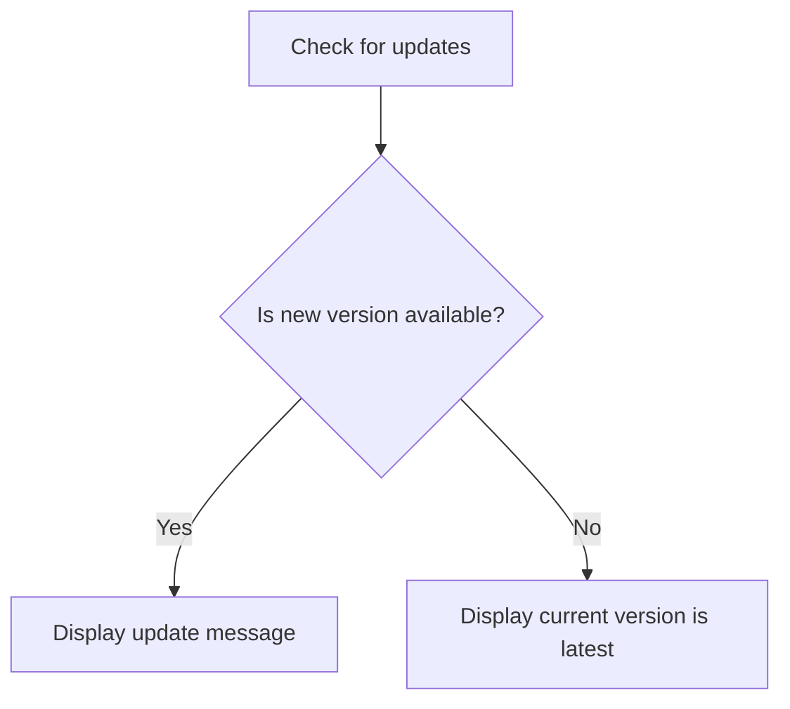
```mermaid
graph TD
    A[Check for updates] --> B{Is new version available?};
    B -- Yes --> C[Display update message];
    B -- No --> D[Display current version is latest];
```

This diagram illustrates the update process, where the CLI tool checks for a new version and informs the user accordingly. [cmd/cli/update_command.go]()

### Resource Management

The Fyodorov CLI tool provides commands for managing resources such as models, agents, tools, providers, and instances. The `fyodorov list` command allows users to list the deployed resources, while the `fyodorov remove` command allows users to remove resources. These commands interact with the Fyodorov platform's APIs to perform these tasks. [cmd/cli/resource_commands.go]()

#### Listing Resources

The `fyodorov list` command allows users to view the resources deployed on the Fyodorov platform. It supports filtering by resource type, allowing users to view only the resources they are interested in. The command retrieves the resource information from the platform's API and displays it in YAML format. [cmd/cli/resource_commands.go]()

```shell
fyodorov list models
```
Sources: [cmd/cli/resource_commands.go]()

#### Removing Resources

The `fyodorov remove` command allows users to remove resources from the Fyodorov platform. The command takes the resource type and the resource name as arguments and sends a request to the platform's API to remove the resource. The tool validates the resource type and name before sending the request, ensuring that the user is not accidentally removing the wrong resource. [cmd/cli/resource_commands.go]()

```shell
fyodorov remove agents "My Agent"
```
Sources: [cmd/cli/resource_commands.go]()

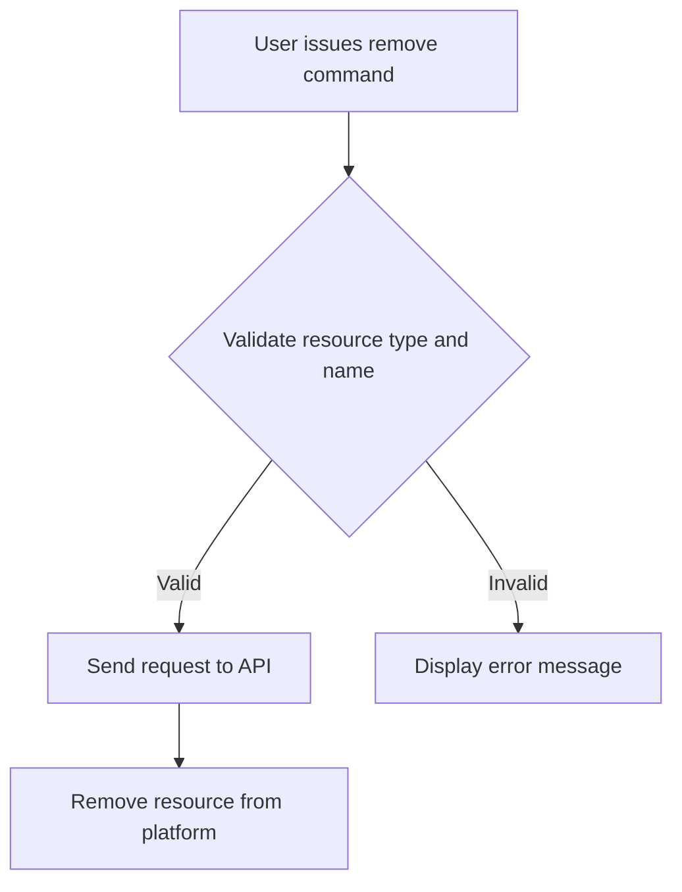
```mermaid
graph TD
    A[User issues remove command] --> B{Validate resource type and name};
    B -- Valid --> C[Send request to API];
    B -- Invalid --> D[Display error message];
    C --> E[Remove resource from platform];
```

This diagram illustrates the resource removal process, including validation and API interaction. [cmd/cli/resource_commands.go]()

### Configuration Validation

The `fyodorov validate` command allows users to validate Fyodorov configuration files. It checks the YAML file for syntax errors and ensures that all required fields are present. This helps users catch errors early in the development process and avoid deployment issues. [cmd/cli/commands.go]()

The validation process includes:

*   Loading the configuration from the file. [cmd/cli/commands.go]()
*   Verifying that there are no unknown fields in the file. [cmd/cli/commands.go]()
*   Validating the configuration against the Fyodorov platform's schema. [cmd/cli/commands.go]()

```shell
fyodorov validate config.yml
```
Sources: [cmd/cli/commands.go]()

## Architecture

The Fyodorov CLI tool architecture can be represented as follows:

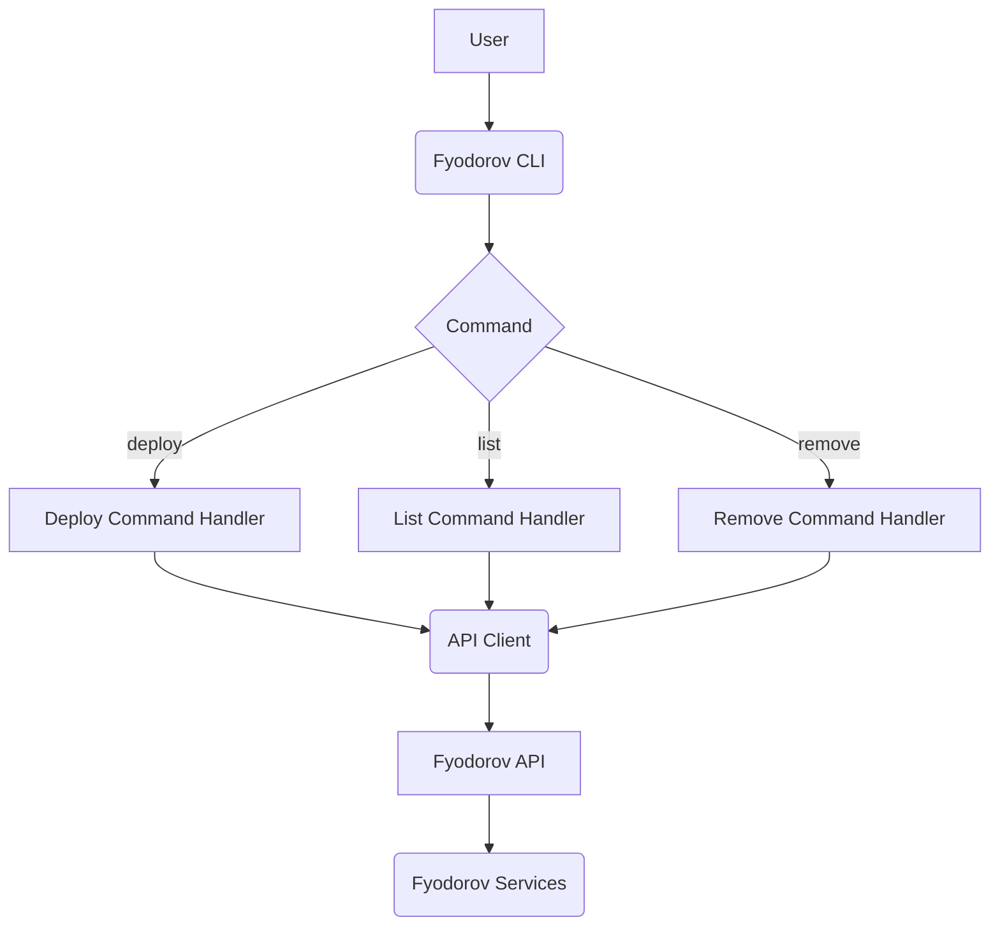
```mermaid
graph TD
    A[User] --> B(Fyodorov CLI);
    B --> C{Command};
    C -- deploy --> D[Deploy Command Handler];
    C -- list --> E[List Command Handler];
    C -- remove --> F[Remove Command Handler];
    D --> G(API Client);
    E --> G;
    F --> G;
    G --> H[Fyodorov API];
    H --> I(Fyodorov Services);
```

This diagram illustrates the high-level architecture of the Fyodorov CLI tool, showing how the user interacts with the tool, how the tool handles different commands, and how the tool interacts with the Fyodorov API. [cmd/cli/commands.go](), [cmd/cli/deploy_commands.go](), [cmd/cli/resource_commands.go](), [internal/api-client/client.go]()

## Conclusion

The Fyodorov CLI tool provides a comprehensive command-line interface for interacting with the Fyodorov platform. It simplifies the process of deploying configurations, managing resources, and performing updates. The tool is designed to be easy to use and provides a consistent experience across different platforms. [README.md](), [cmd/cli/commands.go](), [cmd/cli/deploy_commands.go](), [cmd/cli/resource_commands.go]()


---

<a id='overview-installation'></a>

## Installation

### Related Pages

Related topics: [Introduction](#overview-introduction)

<details>
<summary>Relevant source files</summary>

The following files were used as context for generating this wiki page:

- [README.md](README.md)
- [cmd/cli/main.go](cmd/cli/main.go)
- [cmd/cli/commands.go](cmd/cli/commands.go)
- [internal/common/cli_config.go](internal/common/cli_config.go)
- [cmd/cli/deploy_commands.go](cmd/cli/deploy_commands.go)
- [cmd/cli/resource_commands.go](cmd/cli/resource_commands.go)
</details>

# Installation

The Fyodorov CLI tool streamlines interactions with Fyodorov services, including authentication and deployment. This tool simplifies the process of setting up and using the Fyodorov platform, allowing users to quickly deploy configurations and manage resources. The installation process involves downloading the appropriate binary for your system and setting up the necessary configuration. [Signing Up](#signing-up) and [Deploying the Configuration](#deploying-the-configuration) are key steps after installation.

The tool uses a configuration file to store settings such as the Gagarin URL, Tsiolkovsky URL, email, and password. It also handles authentication, obtaining and storing a JWT for secure access to Fyodorov services. The CLI tool provides commands for validating configurations, deploying resources, and managing the tool's configuration.  [cmd/cli/main.go]()

## Downloading the CLI Tool

Before using the Fyodorov CLI tool, download the correct binary for your system from the [releases page](https://github.com/FyodorovAI/fyodorov-cli/releases).  [README.md]()

## Setting up the Configuration

The Fyodorov CLI tool relies on a configuration file to store settings such as the Gagarin URL, Tsiolkovsky URL, email, and password. The configuration file is typically located in the `.fyodorov` directory in your home directory.  [internal/common/cli_config.go]()

### Configuration File Path

The configuration file path varies based on the operating system. The `GetConfigPath` function in `internal/common/cli_config.go` determines the correct path.

```go
func GetConfigPath() string {
	platform := os.Getenv("GOOS")
	switch platform {
	case "windows":
		return filepath.Join(GetPlatformBasePath(), "config.json")
	default:
		return filepath.Join(GetPlatformBasePath(), "config.json")
	}
}
```

Sources: [internal/common/cli_config.go:42-49]()

### Platform Base Path

The `GetPlatformBasePath` function determines the base directory for storing configuration files.

```go
func GetPlatformBasePath() string {
	platform := os.Getenv("GOOS")
	switch platform {
	case "windows":
		return filepath.Join(os.Getenv("LOCALAPPDATA"), "fyodorov")
	default:
		return filepath.Join(os.Getenv("HOME"), ".fyodorov")
	}
}
```

Sources: [internal/common/cli_config.go:51-58]()

### Initializing the Configuration

The `initConfig` function in `cmd/cli/main.go` is responsible for initializing the configuration. It prompts the user for missing configuration values and saves the configuration to the file. [cmd/cli/main.go]()

```go
func initConfig(cmd *cobra.Command, args []string) {
	fmt.Println("CLI Version", version)
	configRun := cmd.Use == "config"
	reader := bufio.NewReader(os.Stdin)

	// Prompt for missing values
	if !v.IsSet("gagarin-url") {
		fmt.Printf("Enter Gagarin URL (default: %s): ", defaultGagarinURL)
		input, _ := reader.ReadString('\n')
		input = strings.TrimSpace(input)
		if input != "" {
			v.Set("gagarin-url", input)
		} else {
			v.Set("gagarin-url", defaultGagarinURL)
		}
	}
    ...
}
```

Sources: [cmd/cli/main.go:78-154]()

### Configuration Structure

The `Config` struct in `internal/common/cli_config.go` defines the structure of the configuration file.

```go
type Config struct {
	Version        string `json:"version"`
	GagarinURL     string `json:"gagarin_url"`
	TsiolkovskyURL string `json:"tsiolkovsky_url"`
	// DostoyevskyURL string `json:"dostoyevsky_url"`
	Email               string        `json:"email"`
	Password            string        `json:"password"`
	CacheTTL            time.Duration `json:"ttl"`
	JWT                 string        `json:"jwt"`
	TimeOfLastJWTUpdate time.Time     `json:"time_of_last_jwt_update"`
}
```

Sources: [internal/common/cli_config.go:11-21]()

### Configuration Validation

The `Validate` method in `internal/common/cli_config.go` validates the configuration.

```go
func (c *Config) Validate() error {
	if c.Email == "" {
		return fmt.Errorf("email is required")
	}
	if c.Password == "" {
		return fmt.Errorf("password is required")
	}
	if c.GagarinURL == "" {
		return fmt.Errorf("gagarin_url is required")
	}
	return nil
}
```

Sources: [internal/common/cli_config.go:31-40]()

## Signing Up

To start using the Fyodorov services, you must first sign up and authenticate. You can do this directly through the CLI tool using the `fyodorov auth` command.  [README.md]()

```shell
fyodorov auth
```

Sources: [README.md]()

This process typically involves providing an email and password, which are then used to obtain a JWT for authentication. [cmd/cli/main.go]()

## Deploying the Configuration

Once your configuration is set and saved, you can deploy it using the Fyodorov CLI tool:

```shell
fyodorov deploy config.yml
```

Sources: [README.md]()

This command deploys your current configuration to the Fyodorov platform.  You may need to set the API key for the provider. [README.md]()

### Deploy Command

The `deployTemplateCmd` in `cmd/cli/deploy_commands.go` handles the deployment of configurations.

```go
var deployTemplateCmd = &cobra.Command{
	Use:   "deploy file [file1 file2 ...]",
	Short: "Deploy a Fyodorov configuration",
	ValidArgsFunction: func(cmd *cobra.Command, args []string, toComplete string) ([]string, cobra.ShellCompDirective) {
		return []string{"yaml", "yml"}, cobra.ShellCompDirectiveFilterFileExt
	},
	Run: func(cmd *cobra.Command, args []string) {
		var wg sync.WaitGroup

		// Allow deploying multiple configs passed as arguments
		for _, arg := range args {
			wg.Add(1)
			go func(arg string) {
				defer wg.Done()
				deployYamlFile(arg)
			}(arg)
		}
		cache.Update(true)
		wg.Wait()
	},
}
```

Sources: [cmd/cli/deploy_commands.go:20-40]()

### Deploying YAML File

The `deployYamlFile` function in `cmd/cli/deploy_commands.go` handles the actual deployment of a YAML configuration file.

```go
func deployYamlFile(filepath string) {
	FyodorovConfig, err := common.LoadConfig[common.FyodorovConfig](filepath)
	if err != nil {
		fmt.Printf("\033[33mError loading fyodorov config from file %s: %v\n\033[0m", filepath, err)
		return
	}
	// load fyodorov config from values
	if len(values) > 0 {
		FyodorovConfig.ParseKeyValuePairs(values)
	}
	// validate fyodorov config
	err = FyodorovConfig.Validate()
	if err != nil {
		fmt.Printf("\033[33mError validating fyodorov config (%s): %v\n\033[0m", filepath, err)
		return
	}
    ...
}
```

Sources: [cmd/cli/deploy_commands.go:42-100]()

### Dry Run

The `--dry-run` flag allows you to validate the configuration without actually deploying it. [cmd/cli/deploy_commands.go]()

```go
deployTemplateCmd.Flags().BoolVar(&dryRun, "dry-run", false, "Dry run")
```

Sources: [cmd/cli/deploy_commands.go:17]()

### Setting Values

The `--set` flag allows you to override configuration values from the command line.  [README.md]()

```go
deployTemplateCmd.Flags().StringSliceVar(&values, "set", []string{}, "List of key=value pairs (e.g. --set key1=value1,key2=value2)")
```

Sources: [cmd/cli/deploy_commands.go:18]()

## Conclusion

The installation process for the Fyodorov CLI tool involves downloading the correct binary for your system, setting up the configuration, and authenticating with the Fyodorov services. Once these steps are completed, you can deploy configurations and manage resources using the CLI tool. The CLI tool simplifies the interaction with Fyodorov services, making it easier to deploy and manage your configurations. [README.md](), [cmd/cli/main.go](), [internal/common/cli_config.go](), [cmd/cli/deploy_commands.go]()


---

<a id='architecture-overview'></a>

## Architecture Overview

### Related Pages

Related topics: [Data Flow](#architecture-dataflow)

<details>
<summary>Relevant source files</summary>

The following files were used as context for generating this wiki page:

- [cmd/cli/main.go](cmd/cli/main.go)
- [internal/api-client/client.go](internal/api-client/client.go)
- [internal/common/cli_config.go](internal/common/cli_config.go)
- [cmd/cli/config_commands.go](cmd/cli/config_commands.go)
- [cmd/cli/authenticate.go](cmd/cli/authenticate.go)
- [README.md](README.md)
</details>

# Architecture Overview

The fyodorov-cli tool is a command-line interface designed to interact with various services, including Gagarin and Tsiolkovsky. It handles user authentication, configuration management, and deployment of Fyodorov configurations. The CLI tool uses Viper for configuration, Cobra for command-line interface construction, and an internal API client for communicating with backend services.  It supports features like managing configurations, deploying resources, and authenticating users.  The tool is designed to streamline interactions with the Fyodorov ecosystem, providing a user-friendly interface for managing and deploying AI configurations. Sources: [cmd/cli/main.go](), [internal/api-client/client.go](), [internal/common/cli_config.go]()

The architecture involves several key components: the command-line interface built with Cobra, the configuration management system using Viper, and the API client for interacting with backend services.  The CLI tool authenticates users, manages configurations, and facilitates the deployment of resources.  It aims to simplify the deployment and management of AI configurations by providing a unified command-line interface.  The tool also supports features like caching resources to improve performance and reduce the load on backend services. Sources: [cmd/cli/main.go](), [internal/api-client/client.go](), [internal/common/cli_config.go]()

## Configuration Management

The fyodorov-cli tool uses Viper for managing configuration settings. Viper supports reading configurations from various sources, including command-line flags, environment variables, and configuration files. The tool stores its configuration in a `config.json` file located in the platform-specific base path (e.g., `$HOME/.fyodorov` on Linux/macOS or `$LOCALAPPDATA/fyodorov` on Windows). Sources: [internal/common/cli_config.go](), [cmd/cli/main.go]()

### Configuration File

The configuration file stores settings such as the Gagarin URL, Tsiolkovsky URL, email, and password. It also stores the JWT (JSON Web Token) for authentication and the time of the last JWT update. The tool uses these settings to authenticate users and interact with backend services. Sources: [internal/common/cli_config.go](), [cmd/cli/main.go]()

```json
{
  "gagarin_url": "https://gagarin.danielransom.com",
  "tsiolkovsky_url": "https://tsiolkovsky.danielransom.com",
  "email": "user@example.com",
  "password": "password",
  "ttl": 20000000000,
  "jwt": "eyJhbGciOiJIUzI1NiIsInR5cCI6IkpXVCJ9...",
  "time_of_last_jwt_update": "2024-01-01T00:00:00Z"
}
```

Sources: [internal/common/cli_config.go]()

### Configuration Initialization

The `initConfig` function in `cmd/cli/main.go` is responsible for initializing the configuration. It prompts the user for missing configuration values, such as the Gagarin URL, Tsiolkovsky URL, email, and password. It then authenticates the user and saves the updated configuration to the configuration file. Sources: [cmd/cli/main.go](), [cmd/cli/config_commands.go]()

```go
func initConfig(cmd *cobra.Command, args []string) {
	fmt.Println("CLI Version", version)
	configRun := cmd.Use == "config"
	reader := bufio.NewReader(os.Stdin)

	// Prompt for missing values
	if !v.IsSet("gagarin-url") {
		fmt.Printf("Enter Gagarin URL (default: %s): ", defaultGagarinURL)
		input, _ := reader.ReadString('\n')
		input = strings.TrimSpace(input)
		if input != "" {
			v.Set("gagarin-url", input)
		} else {
			v.Set("gagarin-url", defaultGagarinURL)
		}
	}
    // ... other prompts
}
```
Sources: [cmd/cli/main.go:54-70]()

### Configuration Command

The `configCmd` command allows users to manage the Fyodorov configuration. It initializes the configuration and prints the current configuration values. Sources: [cmd/cli/commands.go](), [cmd/cli/main.go]()

```go
var configCmd = &cobra.Command{
	Use:   "config",
	Short: "Manage Fyodorov configuration",
	// Disable persistent pre-run
	PersistentPreRun: func(cmd *cobra.Command, args []string) {
	},
	Run: func(cmd *cobra.Command, args []string) {
		initConfig(cmd, args)
	},
}
```
Sources: [cmd/cli/commands.go:15-25]()

### Environment Variables

The tool will automatically insert any environmental variables into the yaml file. Here's an example yaml file and how to deploy it. Sources: [README.md]()

```yaml
providers:
  - name: openai
    api_url: https://api.openai.com/v1
    api_key: ${OPENAI_API_KEY}
models:
  - name: chatgpt
    provider: openai
```
Sources: [README.md]()

## Authentication

The fyodorov-cli tool authenticates users using an email and password. It obtains a JWT from the backend service and stores it in the configuration file. The tool uses this JWT to authenticate subsequent requests to the backend service. Sources: [internal/api-client/client.go](), [internal/common/cli_config.go](), [cmd/cli/main.go]()

### Authentication Flow

The authentication flow involves the following steps:

1.  The user provides their email and password.
2.  The CLI tool sends a request to the `/users/sign_in` endpoint with the email and password.
3.  The backend service authenticates the user and returns a JWT.
4.  The CLI tool stores the JWT in the configuration file.
5.  The CLI tool includes the JWT in the `Authorization` header of subsequent requests.

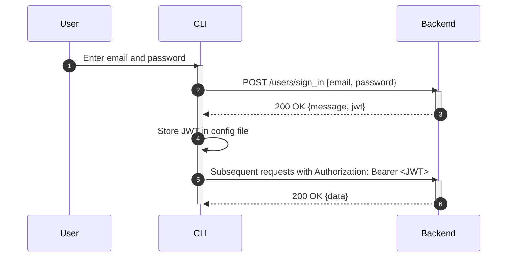
```mermaid
sequenceDiagram
    autonumber
    participant User
    participant CLI
    participant Backend

    User->>CLI: Enter email and password
    activate CLI
    CLI->>Backend: POST /users/sign_in {email, password}
    activate Backend
    Backend-->>CLI: 200 OK {message, jwt}
    deactivate Backend
    CLI->>CLI: Store JWT in config file
    CLI->>Backend: Subsequent requests with Authorization: Bearer <JWT>
    activate Backend
    Backend-->>CLI: 200 OK {data}
    deactivate Backend
    deactivate CLI
```

Sources: [internal/api-client/client.go:60-90](), [internal/common/cli_config.go]()

### API Client Authentication

The `Authenticate` method in `internal/api-client/client.go` handles the authentication process. It sends a request to the `/users/sign_in` endpoint and stores the JWT in the Viper configuration. Sources: [internal/api-client/client.go]()

```go
func (client *APIClient) Authenticate() error {
	if client.Viper.IsSet("jwt") && client.Viper.GetTime("time_of_last_jwt_update").Add(client.Viper.GetDuration("jwt_ttl")).After(time.Now()) {
		client.AuthToken = client.Viper.GetString("jwt")
		return nil
	}
	// Implement authentication with the API to obtain AuthToken
	body := bytes.NewBuffer([]byte{})
	json.NewEncoder(body).Encode(map[string]string{"email": client.Email, "password": client.Password})
	responseBody, err := client.CallAPI("POST", "/users/sign_in", body)
    // ...
}
```
Sources: [internal/api-client/client.go:60-70]()

### Authentication Command

The `authCmd` command allows users to authenticate with the Fyodorov service. It prompts the user for their email and password, and then calls the `Authenticate` method in `internal/api-client/client.go` to obtain a JWT. Sources: [cmd/cli/authenticate.go]()

```go
var authCmd = &cobra.Command{
	Use:   "auth",
	Short: "Fyodorov authentication: sign up, log in, etc.",
	Run: func(cmd *cobra.Command, args []string) {
        // ...
    }
}
```
Sources: [cmd/cli/authenticate.go:15-19]()

## API Client

The fyodorov-cli tool uses an internal API client to communicate with backend services. The API client handles authentication, request signing, and response parsing. Sources: [internal/api-client/client.go]()

### API Client Structure

The `APIClient` struct in `internal/api-client/client.go` defines the structure of the API client. It includes fields for the base URL, email, password, and authentication token. Sources: [internal/api-client/client.go]()

```go
type APIClient struct {
	BaseURL   string
	Email     string
	Password  string
	AuthToken string
	Viper     *viper.Viper
}
```
Sources: [internal/api-client/client.go:21-27]()

### API Call

The `CallAPI` method in `internal/api-client/client.go` makes a generic API call. It takes the HTTP method, endpoint, and request body as input. It sets the `Authorization` header with the JWT and sends the request to the backend service. Sources: [internal/api-client/client.go]()

```go
func (c *APIClient) CallAPI(method, endpoint string, body *bytes.Buffer) (io.ReadCloser, error) {
	// Check if first character of endpoint is '/' and if not add it
	if endpoint[0] != '/' {
		endpoint = "/" + endpoint
	}
	url := c.BaseURL + endpoint
	var req *http.Request
	var err error
	if body == nil {
		req, err = http.NewRequest(method, url, nil)
	} else {
		req, err = http.NewRequest(method, url, body)
	}
	if err != nil {
		return nil, err
	}
	// Set the necessary headers, for example, Authorization headers
	if c.AuthToken != "" {
		req.Header.Set("Authorization", "Bearer "+c.AuthToken)
	}
	req.Header.Set("User-Agent", "fyodorov-cli-tool")
	resp, err := httpClient.Do(req)
	if err != nil {
		return nil, err
	}
	if resp.StatusCode >= 400 {
		// Handle HTTP errors here
		return nil, fmt.Errorf("[%s] API request error: %s", url, resp.Status)
	}
	return resp.Body, nil
}
```
Sources: [internal/api-client/client.go:92-124]()

## Conclusion

The fyodorov-cli tool employs a modular architecture centered around configuration management, user authentication, and API communication. It leverages industry-standard libraries like Viper and Cobra to provide a robust and user-friendly command-line experience. The tool streamlines interactions with the Fyodorov ecosystem, simplifying the deployment and management of AI configurations.


---

<a id='architecture-dataflow'></a>

## Data Flow

### Related Pages

Related topics: [Architecture Overview](#architecture-overview)

<details>
<summary>Relevant source files</summary>

The following files were used as context for generating this wiki page:

- [internal/api-client/client.go](internal/api-client/client.go)
- [internal/common/fyodorov_config.go](internal/common/fyodorov_config.go)
- [cmd/cli/deploy_commands.go](cmd/cli/deploy_commands.go)
- [cmd/cli/resource_commands.go](cmd/cli/resource_commands.go)
- [cmd/cli/commands.go](cmd/cli/commands.go)
- [internal/common/generic.go](internal/common/generic.go)
</details>

# Data Flow

The Fyodorov CLI tool manages the deployment and validation of configurations, as well as interaction with deployed agents. Data flow within the CLI involves loading configurations from files, validating them, sending them to Gagarin (or other services), and retrieving resource information. This page outlines the data flow for these operations, focusing on the configuration loading, validation, deployment, and resource management aspects of the tool.

## Configuration Loading

The CLI loads configurations from YAML or JSON files. The `LoadConfig` function in `internal/common/generic.go` handles this process. It reads the file, expands environment variables within the file content, and then unmarshals the data into a struct. The format is determined by the file extension.  The `validateTemplateCmd` in `cmd/cli/commands.go` also uses this to load and validate configurations.

```go
// internal/common/generic.go
func LoadConfig[T any](filename string) (*T, error) {
	fileBytes, err := os.ReadFile(filename)
	if err != nil {
		return nil, err
	}

	// Expand environment variables in the file contents
	//  Any ${FOO} will be replaced with os.Getenv("FOO")
	expanded := os.ExpandEnv(string(fileBytes))

	var config T
	switch filepath.Ext(filename) {
	case ".json":
		if err := json.Unmarshal([]byte(expanded), &config); err != nil {
			fmt.Printf("\033[33mError unmarshaling json config from file %s:\n  %v\n\033[0m", filename, err)
			return nil, err
		}
	case ".yaml", ".yml":
		dec := yaml.NewDecoder(bytes.NewReader([]byte(expanded)))
		dec.KnownFields(true) // ← reject any unknown fields
		if err := dec.Decode(&config); err != nil {
			fmt.Printf("\033[33mError unmarshaling yaml config from file %s:\n  %v\n\033[0m", filename, err)
			return nil, err
		}
	default:
		fmt.Printf("\033[33mError loading config from unsupported file format %s:\n  %v\n\033[0m", filename, err)
		return nil, fmt.Errorf("unsupported file format")
	}

	return &config, nil
}
```

Sources: [internal/common/generic.go:8-45]()

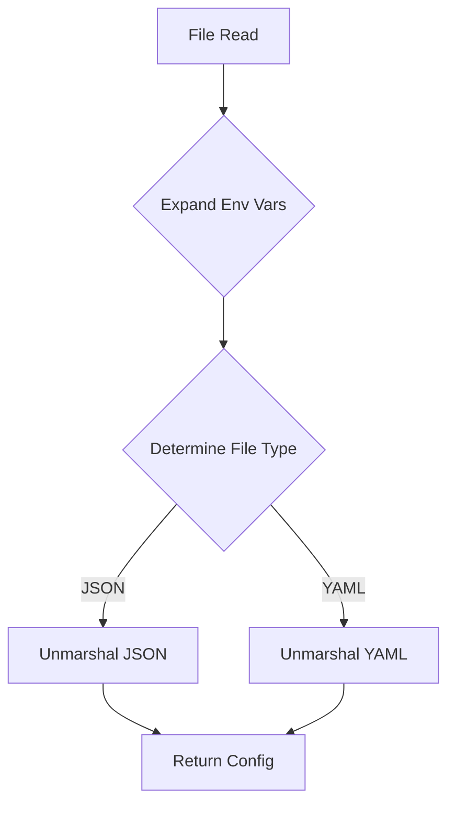
```mermaid
graph TD
    A[File Read] --> B{Expand Env Vars};
    B --> C{Determine File Type};
    C --> |JSON| D[Unmarshal JSON];
    C --> |YAML| E[Unmarshal YAML];
    D --> F[Return Config];
    E --> F;
```

This diagram illustrates the configuration loading process, starting from reading the file, expanding environment variables, determining the file type (JSON or YAML), unmarshaling the data, and finally returning the configuration. Sources: [internal/common/generic.go:8-45]()

## Configuration Validation

After loading, the configuration is validated using the `Validate` method defined on the `FyodorovConfig` struct in `internal/common/fyodorov_config.go`. This method checks the version, providers, models, agents and tools for validity.  The `validateYamlFile` function in `cmd/cli/commands.go` performs the validation after loading the config.

```go
// internal/common/fyodorov_config.go
func (config *FyodorovConfig) Validate() error {
	if config.Version != nil && *config.Version != "" {
		// check if version is in valid semver format
		if _, err := semver.NewVersion(*config.Version); err != nil {
			return err
		}
	}
	if config.Providers != nil {
		for _, provider := range config.Providers {
			if err := provider.Validate(); err != nil {
				return err
			}
		}
	}
	if config.Models != nil {
		for _, model := range config.Models {
			if err := model.Validate(); err != nil {
				return err
			}
		}
	}
	if config.Agents != nil {
		for _, agent := range config.Agents {
			if err := agent.Validate(); err != nil {
				return err
			}
		}
	}
	if config.Tools != nil {
		for _, tool := range config.Tools {
			if err := tool.Validate(); err != nil {
				return err
			}
		}
	}
	return nil
}
```

Sources: [internal/common/fyodorov_config.go:67-101]()

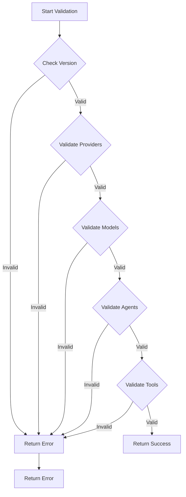
```mermaid
graph TD
    A[Start Validation] --> B{Check Version};
    B --> |Valid| C{Validate Providers};
    B --> |Invalid| E[Return Error];
    C --> |Valid| D{Validate Models};
    C --> |Invalid| E;
    D --> |Valid| F{Validate Agents};
    D --> |Invalid| E;
    F --> |Valid| G{Validate Tools};
    F --> |Invalid| E;
    G --> |Valid| H[Return Success];
    G --> |Invalid| E;
    E --> I[Return Error];
```

This diagram shows the flow of the validation process, checking version, providers, models, agents, and tools, and returning either success or an error if any validation fails. Sources: [internal/common/fyodorov_config.go:67-101]()

## Configuration Deployment

The `deployYamlFile` function in `cmd/cli/deploy_commands.go` handles the deployment of configurations. It loads the configuration, validates it, and then sends it to the Gagarin service via the API client. The `dryRun` flag allows for validation and printing of the configuration without actual deployment.

```go
// cmd/cli/deploy_commands.go
func deployYamlFile(filepath string) {
	FyodorovConfig, err := common.LoadConfig[common.FyodorovConfig](filepath)
	if err != nil {
		fmt.Printf("\033[33mError loading fyodorov config from file %s: %v\n\033[0m", filepath, err)
		return
	}
	// load fyodorov config from values
	if len(values) > 0 {
		FyodorovConfig.ParseKeyValuePairs(values)
	}
	// validate fyodorov config
	err = FyodorovConfig.Validate()
	if err != nil {
		fmt.Printf("\033[33mError validating fyodorov config (%s): %v\n\033[0m", filepath, err)
		return
	}
	// print fyodorov config to stdout
	if dryRun {
		bytes, err := yaml.Marshal(FyodorovConfig)
		if err != nil {
			fmt.Printf("\033[33mError marshaling fyodorov config to yaml: %v\n\033[0m", err)
			return
		}
		// Print the YAML to stdout
		fmt.Printf("\033[36mValidated config %s\033[0m\n", filepath)
		fmt.Printf("---Fyodorov config---\n%s\n", string(bytes))
		return
	}
	// deploy config to Gagarin
	if !dryRun {
		yamlBytes, err := yaml.Marshal(FyodorovConfig)
		if err != nil {
			fmt.Printf("\033[34mError marshaling config to yaml: %v\n\033[0m", err)
			return
		}
		client, err := api.NewAPIClient(v, "")
		if err != nil {
			return
		}
		err = client.Authenticate()
		if err != nil {
			fmt.Println("\033[33mError authenticating during deploy:\033[0m", err)
			fmt.Println("\033[33mUnable to authenticate with this config\033[0m")
			return
		}
		var yamlBuffer bytes.Buffer
		yamlBuffer.Write(yamlBytes)
		res, err := client.CallAPI("POST", "/yaml", &yamlBuffer)
		if err != nil {
			fmt.Printf("\033[33mError deploying config (%s): %v\n\033[0m", filepath, err.Error())
			return
		}
		defer res.Close()
		body, err := io.ReadAll(res)
		if err != nil {
			fmt.Printf("\033[33mError reading response body while deploying config: %v\n\033[0m", err)
			return
		}
		var bodyResponse BodyResponse
		err = json.Unmarshal(body, &bodyResponse)
		if err != nil {
			fmt.Printf("\033[33mError unmarshaling response body while deploying config (%s): %s\n\t%v\n\033[0m", filepath, string(body), err)
			return
		}
		// Print deployed config
		fmt.Printf("\033[36mDeployed config %s\033[0m\n", filepath)
	}
}
```

Sources: [cmd/cli/deploy_commands.go:49-139]()

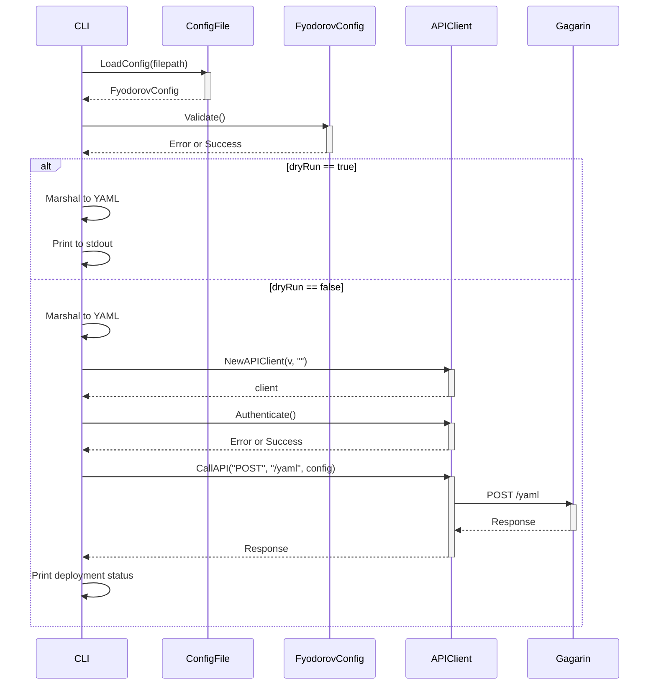
```mermaid
sequenceDiagram
    participant CLI
    participant ConfigFile
    participant FyodorovConfig
    participant APIClient
    participant Gagarin

    CLI->>ConfigFile: LoadConfig(filepath)
    activate ConfigFile
    ConfigFile-->>CLI: FyodorovConfig
    deactivate ConfigFile

    CLI->>FyodorovConfig: Validate()
    activate FyodorovConfig
    FyodorovConfig-->>CLI: Error or Success
    deactivate FyodorovConfig

    alt dryRun == true
        CLI->>CLI: Marshal to YAML
        CLI->>CLI: Print to stdout
    else dryRun == false
        CLI->>CLI: Marshal to YAML
        CLI->>APIClient: NewAPIClient(v, "")
        activate APIClient
        APIClient-->>CLI: client
        deactivate APIClient
        CLI->>APIClient: Authenticate()
        activate APIClient
        APIClient-->>CLI: Error or Success
        deactivate APIClient
        CLI->>APIClient: CallAPI("POST", "/yaml", config)
        activate APIClient
        APIClient->>Gagarin: POST /yaml
        activate Gagarin
        Gagarin-->>APIClient: Response
        deactivate Gagarin
        APIClient-->>CLI: Response
        deactivate APIClient
        CLI->>CLI: Print deployment status
    end
```

This sequence diagram illustrates the data flow during configuration deployment, including loading, validation, authentication, and sending the configuration to the Gagarin service. Sources: [cmd/cli/deploy_commands.go:49-139](), [internal/api-client/client.go]()

## Resource Management

The `listResourcesCmd` and `removeResourcesCmd` in `cmd/cli/resource_commands.go` handle listing and removing deployed resources. The `GetResources` function retrieves the resource information, potentially from a cache file or by calling the API. The `DeleteResources` function calls the API to remove specified resources.

```go
// cmd/cli/resource_commands.go
var listResourcesCmd = &cobra.Command{
	Use:     fmt.Sprintf("list (ls) [resource type:%s]", strings.Join(resourceTypes, "|")),
	Short:   "List deployed resources for a user",
	Aliases: []string{"ls"},
	ValidArgsFunction: func(cmd *cobra.Command, args []string, toComplete string) ([]string, cobra.ShellCompDirective) {
		autocompleteResourceTypes := slices.DeleteFunc(resourceTypes, func(s string) bool {
			return slices.Contains(args, s)
		})
		return autocompleteResourceTypes, cobra.ShellCompDirectiveNoFileComp
	},
	Run: func(cmd *cobra.Command, args []string) {
		resources := GetResources()
		var bytes []byte
		var err error
		if len(args) > 0 {
			for _, resourceType := range args {
				if !resourceTypes.Contains(resourceType) {
					fmt.Printf("\033[33mInvalid resource type: %s. Valid types are: %v\033[0m\n", resourceType, resourceTypes)
					os.Exit(1)
				}
				switch resourceType {
				case "models":
					bytes, err = yaml.Marshal(resources.Models)
				case "agents":
					bytes, err = yaml.Marshal(resources.Agents)
				case "tools":
					bytes, err = yaml.Marshal(resources.Tools)
				case "providers":
					bytes, err = yaml.Marshal(resources.Providers)
				case "instances":
					bytes, err = yaml.Marshal(resources.Instances)
				default:
					fmt.Printf("\033[33mInvalid resource type: %s. Valid types are: %v\033[0m\n", resourceType, resourceTypes)
					os.Exit(1)
				}
				if err != nil {
					fmt.Printf("\033[33mError marshaling fyodorov config to yaml: %v\n\033[0m", err)
					return
				}
				// Print the YAML to stdout
				fmt.Printf("\033[36m---%s resources---:\033[0m\n", strings.Title(resourceType))
				fmt.Printf("%s\n", string(bytes))
			}
		} else {
			resources.TimeOfLastCacheUpdate = nil
			resources.Version = nil
			bytes, err = yaml.Marshal(resources)
			if err != nil {
				fmt.Printf("\033[33mError marshaling fyodorov config to yaml: %v\n\033[0m", err)
				return
			}
			// Print the YAML to stdout
			fmt.Printf("\033[36m---Resources---:\033[0m\n")
			fmt.Printf("%s\n", string(bytes))
		}
	},
}
```

Sources: [cmd/cli/resource_commands.go:55-127]()

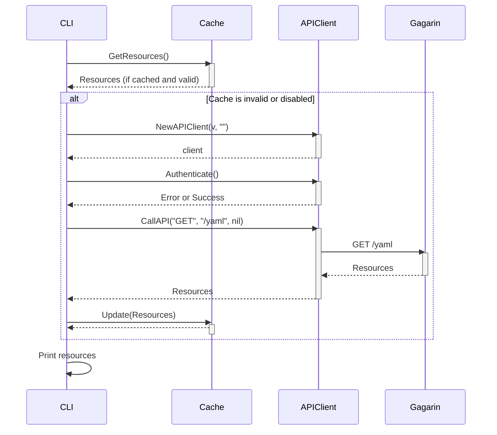
```mermaid
sequenceDiagram
    participant CLI
    participant Cache
    participant APIClient
    participant Gagarin

    CLI->>Cache: GetResources()
    activate Cache
    Cache-->>CLI: Resources (if cached and valid)
    deactivate Cache

    alt Cache is invalid or disabled
        CLI->>APIClient: NewAPIClient(v, "")
        activate APIClient
        APIClient-->>CLI: client
        deactivate APIClient
        CLI->>APIClient: Authenticate()
        activate APIClient
        APIClient-->>CLI: Error or Success
        deactivate APIClient
        CLI->>APIClient: CallAPI("GET", "/yaml", nil)
        activate APIClient
        APIClient->>Gagarin: GET /yaml
        activate Gagarin
        Gagarin-->>APIClient: Resources
        deactivate Gagarin
        APIClient-->>CLI: Resources
        deactivate APIClient
        CLI->>Cache: Update(Resources)
        activate Cache
        Cache-->>CLI:
        deactivate Cache
    end

    CLI->>CLI: Print resources
```

This sequence diagram shows how the CLI retrieves resources, either from the cache or by calling the API, and then prints them to the console. Sources: [cmd/cli/resource_commands.go](), [internal/api-client/client.go]()

## API Client Interaction

The `APIClient` in `internal/api-client/client.go` is responsible for making API calls to the backend services. It handles authentication, sets headers, and processes responses. The `CallAPI` method makes generic API calls, and the `Authenticate` method handles user authentication and JWT token retrieval.

```go
// internal/api-client/client.go
func (c *APIClient) CallAPI(method, endpoint string, body *bytes.Buffer) (io.ReadCloser, error) {
	// Check if first character of endpoint is '/' and if not add it
	if endpoint[0] != '/' {
		endpoint = "/" + endpoint
	}
	url := c.BaseURL + endpoint
	var req *http.Request
	var err error
	if body == nil {
		req, err = http.NewRequest(method, url, nil)
	} else {
		req, err = http.NewRequest(method, url, body)
	}
	if err != nil {
		return nil, err
	}
	// Set the necessary headers, for example, Authorization headers
	if c.AuthToken != "" {
		req.Header.Set("Authorization", "Bearer "+c.AuthToken)
	}
	req.Header.Set("User-Agent", "fyodorov-cli-tool")
	resp, err := httpClient.Do(req)
	if err != nil {
		return nil, err
	}
	if resp.StatusCode >= 400 {
		// Handle HTTP errors here
		return nil, fmt.Errorf("[%s] API request error: %s", url, resp.Status)
	}
	return resp.Body, nil
}
```

Sources: [internal/api-client/client.go:91-125]()

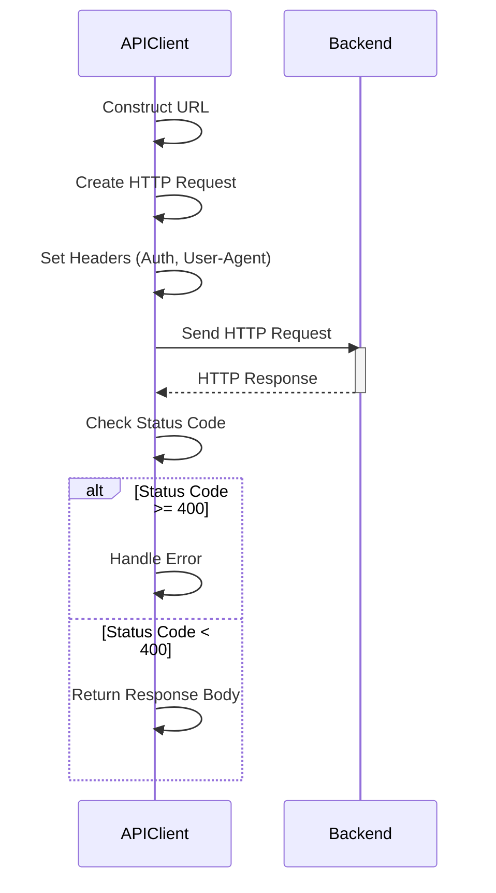
```mermaid
sequenceDiagram
    participant APIClient
    participant Backend

    APIClient->>APIClient: Construct URL
    APIClient->>APIClient: Create HTTP Request
    APIClient->>APIClient: Set Headers (Auth, User-Agent)
    APIClient->>Backend: Send HTTP Request
    activate Backend
    Backend-->>APIClient: HTTP Response
    deactivate Backend
    APIClient->>APIClient: Check Status Code
    alt Status Code >= 400
        APIClient->>APIClient: Handle Error
    else Status Code < 400
        APIClient->>APIClient: Return Response Body
    end
```

This sequence diagram outlines the steps involved in making an API call, including constructing the URL, creating the HTTP request, setting headers, sending the request, and handling the response. Sources: [internal/api-client/client.go:91-125]()

## Conclusion

The data flow within the Fyodorov CLI tool encompasses configuration loading, validation, deployment, resource management, and API client interaction. The tool uses configuration files, validates them against a schema, and then deploys them to backend services. Resource management involves retrieving and manipulating resources via API calls. The `APIClient` component plays a central role in communicating with backend services, handling authentication, and processing responses.


---

<a id='features-authentication'></a>

## Authentication

### Related Pages

Related topics: [Configuration Deployment](#features-deployment), [Configuration Details](#configuration-details)

<details>
<summary>Relevant source files</summary>

The following files were used as context for generating this wiki page:

- [cmd/cli/authenticate.go](cmd/cli/authenticate.go)
- [internal/api-client/client.go](internal/api-client/client.go)
- [internal/common/cli_config.go](internal/common/cli_config.go)
- [cmd/cli/main.go](cmd/cli/main.go)
- [cmd/cli/commands.go](cmd/cli/commands.go)
- [cmd/cli/deploy_commands.go](cmd/cli/deploy_commands.go)
</details>

# Authentication

Authentication in the fyodorov-cli tool is primarily handled to authorize users and grant them access to the Fyodorov platform's resources. It involves obtaining an authentication token (JWT) and using it for subsequent API calls. The tool supports both signing up and logging in, storing user credentials and tokens in a configuration file for future use. This mechanism ensures that only authenticated users can deploy, manage, and interact with the Fyodorov platform.

## Authentication Process

The authentication process involves checking for an existing valid JWT, and if one is not found, authenticating with the API using the user's email and password.

### Authentication Flow

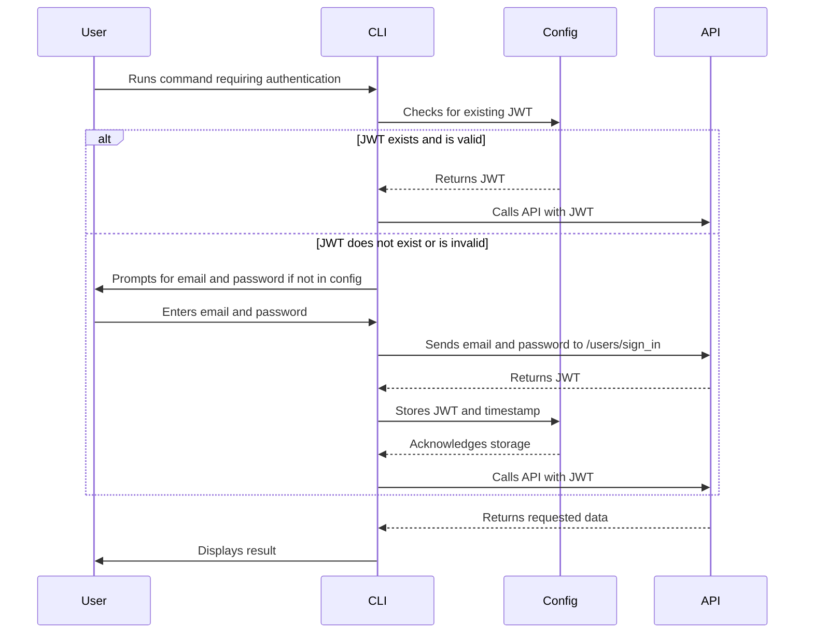
```mermaid
sequenceDiagram
    participant User
    participant CLI
    participant Config
    participant API

    User->>CLI: Runs command requiring authentication
    CLI->>Config: Checks for existing JWT
    alt JWT exists and is valid
        Config-->>CLI: Returns JWT
        CLI->>API: Calls API with JWT
    else JWT does not exist or is invalid
        CLI->>User: Prompts for email and password if not in config
        User->>CLI: Enters email and password
        CLI->>API: Sends email and password to /users/sign_in
        API-->>CLI: Returns JWT
        CLI->>Config: Stores JWT and timestamp
        Config-->>CLI: Acknowledges storage
        CLI->>API: Calls API with JWT
    end
    API-->>CLI: Returns requested data
    CLI->>User: Displays result
```

This diagram illustrates the flow of authentication, from checking for an existing JWT to obtaining a new one from the API. Sources: [internal/api-client/client.go:41-100](), [cmd/cli/authenticate.go:40-125](), [internal/common/cli_config.go:30-40]().

### Key Functions

*   **`NewAPIClient(v *viper.Viper, baseURL string)`**: Creates a new API client, retrieving configuration from Viper and setting up the client with the base URL, email, password, and authentication token if available. Sources: [internal/api-client/client.go:30-57]()
*   **`Authenticate() error`**: Handles the authentication process, checking for an existing JWT, and if not, calling the API to obtain a new one. Sources: [internal/api-client/client.go:60-100]()
*   **`CallAPI(method, endpoint string, body *bytes.Buffer) (io.ReadCloser, error)`**: Makes a generic API call, setting the necessary headers, including the Authorization header with the JWT. Sources: [internal/api-client/client.go:103-129]()
*   **`initConfig(cmd *cobra.Command, args []string)`**: Initializes the configuration, prompting the user for missing values such as Gagarin URL, email, and password, and authenticates the user. Sources: [cmd/cli/main.go:75-163]()

### Code Snippet: Authentication

```go
func (client *APIClient) Authenticate() error {
	if client.Viper.IsSet("jwt") && client.Viper.GetTime("time_of_last_jwt_update").Add(client.Viper.GetDuration("jwt_ttl")).After(time.Now()) {
		client.AuthToken = client.Viper.GetString("jwt")
		return nil
	}
	// Implement authentication with the API to obtain AuthToken
	body := bytes.NewBuffer([]byte{})
	json.NewEncoder(body).Encode(map[string]string{"email": client.Email, "password": client.Password})
	responseBody, err := client.CallAPI("POST", "/users/sign_in", body)
	if err != nil {
		fmt.Printf("\033[0;31mError authenticating (POST %s/users/sign_in):\033[0m +%v\n", client.BaseURL, err.Error())
		return err
	}
	var response struct {
		Message string `json:"message"`
		JWT     string `json:"jwt"`
	}
	err = json.NewDecoder(responseBody).Decode(&response)
	if err != nil {
		return err
	}
	// fmt.Println(response.Message)
	client.AuthToken = response.JWT
	client.Viper.Set("jwt", response.JWT)
	client.Viper.Set("time_of_last_jwt_update", time.Now())
	err = client.Viper.WriteConfig()
	if err != nil {
		return err
	}
	return nil
}
```

This code snippet shows the `Authenticate` function, which checks for a valid JWT and, if necessary, authenticates with the API to obtain a new one. Sources: [internal/api-client/client.go:60-100]()

## Configuration

The fyodorov-cli tool uses Viper for configuration management. It stores configuration values in a file, including the Gagarin URL, email, password, and JWT.

### Configuration File

The configuration file is stored in the following locations, depending on the platform:

*   **Windows:** `%LOCALAPPDATA%\fyodorov\config.json`
*   **Other platforms:** `$HOME/.fyodorov/config.json`

Sources: [internal/common/cli_config.go:64-76]()

### Configuration Parameters

The following table summarizes the key configuration parameters:

| Parameter             | Description                                                                  | Type           | Default Value                                   |
| --------------------- | ---------------------------------------------------------------------------- | -------------- | ----------------------------------------------- |
| `gagarin-url`         | Base URL for the Gagarin API.                                              | string         | `https://gagarin.danielransom.com`              |
| `tsiolkovsky-url`     | Base URL for the Tsiolkovsky API.                                          | string         | `https://tsiolkovsky.danielransom.com`          |
| `email`               | Email for authentication.                                                    | string         | ""                                              |
| `password`            | Password for authentication.                                                 | string         | ""                                              |
| `ttl`                 | Cache TTL (Time To Live) for cached resources.                               | `time.Duration`| `20 * time.Second`                              |
| `jwt`                 | JSON Web Token for authentication.                                           | string         | ""                                              |
| `jwt_ttl`             | JWT TTL (Time To Live)                                                       | `time.Duration`| `20 * time.Minute`                              |
| `time_of_last_jwt_update`| Time of the last JWT update.                                               | `time.Time`    | `time.Now().Add(-1*JWT_TTL)`                     |

Sources: [internal/common/cli_config.go:17-27](), [internal/common/cli_config.go:98-110]()

### Code Snippet: Viper Initialization

```go
func InitViper() *viper.Viper {
	v := viper.New()
	// Set default values
	v.SetDefault("gagarin-url", "https://gagarin.danielransom.com")
	v.SetDefault("tsiolkovsky-url", "https://tsiolkovsky.danielransom.com")
	// v.SetDefault("dostoyevsky-url", "https://dostoyevsky.danielransom.com")
	v.SetDefault("email", "")
	v.SetDefault("password", "")
	v.SetDefault("ttl", defaultTTL)
	v.SetDefault("jwt", "")
	v.SetDefault("jwt_ttl", JWT_TTL)
	v.SetDefault("time_of_last_jwt_update", time.Now().Add(-1*JWT_TTL))

	// Set the config file
```

This code snippet shows how Viper is initialized with default values for the configuration parameters. Sources: [internal/common/cli_config.go:98-110]()

## Authentication Command

The `auth` command is used for authenticating with the Fyodorov platform. It allows users to sign up or log in, storing their credentials and JWT in the configuration file. Sources: [cmd/cli/authenticate.go:26-30]()

### Command Usage

```
fyodorov auth
```

### Authentication Sequence

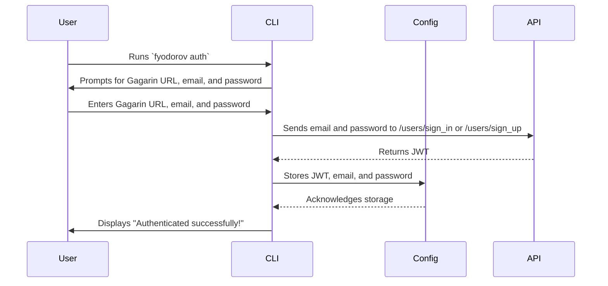
```mermaid
sequenceDiagram
    participant User
    participant CLI
    participant Config
    participant API

    User->>CLI: Runs `fyodorov auth`
    CLI->>User: Prompts for Gagarin URL, email, and password
    User->>CLI: Enters Gagarin URL, email, and password
    CLI->>API: Sends email and password to /users/sign_in or /users/sign_up
    API-->>CLI: Returns JWT
    CLI->>Config: Stores JWT, email, and password
    Config-->>CLI: Acknowledges storage
    CLI->>User: Displays "Authenticated successfully!"
```

This diagram illustrates the sequence of events when using the `auth` command to authenticate with the Fyodorov platform. Sources: [cmd/cli/authenticate.go:40-125]()

## JWT Management

The JWT is stored in the configuration file and used for subsequent API calls. The tool checks for the JWT's validity before making API calls, refreshing it if necessary.

### JWT Expiry

The `JWTExpired()` function checks if the JWT has expired based on the `jwt_ttl` configuration parameter. Sources: [internal/common/cli_config.go:30-34]()

### Code Snippet: JWT Expiry Check

```go
func (c *Config) JWTExpired() bool {
	if c.JWT != "" && time.Since(c.TimeOfLastJWTUpdate) > JWT_TTL {
		return false
	}
	return true
}
```

This code snippet shows the `JWTExpired` function, which checks if the JWT has expired. Sources: [internal/common/cli_config.go:30-34]()

## Conclusion

Authentication is a critical component of the fyodorov-cli tool, ensuring that only authorized users can access and manage resources on the Fyodorov platform. The tool uses a JWT-based authentication mechanism, storing credentials and tokens in a configuration file for future use. The `auth` command simplifies the authentication process, allowing users to sign up or log in and obtain a valid JWT.


---

<a id='features-deployment'></a>

## Configuration Deployment

### Related Pages

Related topics: [Authentication](#features-authentication), [Configuration Validation](#configuration-validation)

<details>
<summary>Relevant source files</summary>

The following files were used as context for generating this wiki page:

- [cmd/cli/deploy_commands.go](cmd/cli/deploy_commands.go)
- [internal/common/fyodorov_config.go](internal/common/fyodorov_config.go)
- [cmd/cli/commands.go](cmd/cli/commands.go)
- [internal/api-client/client.go](internal/api-client/client.go)
- [cmd/cli/main.go](cmd/cli/main.go)
- [internal/common/generic.go](internal/common/generic.go)
</details>

# Configuration Deployment

Configuration deployment in the Fyodorov CLI tool refers to the process of taking a Fyodorov configuration file (typically in YAML format) and applying it to the Fyodorov platform. This process involves loading the configuration file, validating its contents, and then sending it to the Fyodorov API for deployment. The tool supports features such as dry runs to preview the deployment and setting values via command-line arguments to override configuration parameters. [cmd/cli/deploy_commands.go]()

## Deployment Process

The `deployTemplateCmd` Cobra command handles the deployment process. It accepts one or more YAML files as arguments, reads each file, validates the configuration, and deploys it to the Fyodorov platform. [cmd/cli/deploy_commands.go]()

### Command Structure

The `deployTemplateCmd` is defined as follows:

```go
var deployTemplateCmd = &cobra.Command{
	Use:   "deploy file [file1 file2 ...]",
	Short: "Deploy a Fyodorov configuration",
	ValidArgsFunction: func(cmd *cobra.Command, args []string, toComplete string) ([]string, cobra.ShellCompDirective) {
		return []string{"yaml", "yml"}, cobra.ShellCompDirectiveFilterFileExt
	},
	Run: func(cmd *cobra.Command, args []string) {
		var wg sync.WaitGroup

		// Allow deploying multiple configs passed as arguments
		for _, arg := range args {
			wg.Add(1)
			go func(arg string) {
				defer wg.Done()
				deployYamlFile(arg)
			}(arg)
		}
		cache.Update(true)
		wg.Wait()
	},
}
```

This command uses the `cobra` library to define its structure, including usage, a short description, and the function to execute when the command is run. It also defines a `ValidArgsFunction` to enable shell completion for YAML and YML files. [cmd/cli/deploy_commands.go:22-42]()

### Deployment Function

The `deployYamlFile` function is responsible for the core deployment logic. It performs the following steps:

1.  **Load Configuration:** Loads the Fyodorov configuration from the specified YAML file.
2.  **Override Values:** Parses and applies key-value pairs provided via the `--set` flag to override configuration values.
3.  **Validate Configuration:** Validates the loaded configuration to ensure it is correct.
4.  **Dry Run (Optional):** If the `--dry-run` flag is set, the function prints the validated configuration to standard output instead of deploying it.
5.  **Deploy to Gagarin:** If not a dry run, the function marshals the configuration to YAML and sends it to the Gagarin API endpoint for deployment. [cmd/cli/deploy_commands.go]()

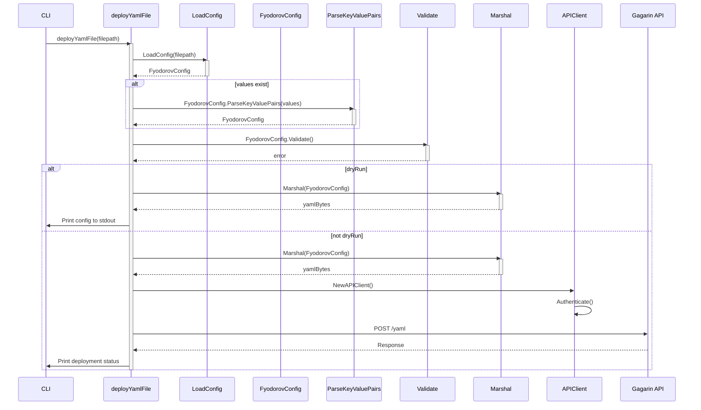
```mermaid
sequenceDiagram
  participant CLI
  participant deployYamlFile
  participant LoadConfig
  participant FyodorovConfig
  participant ParseKeyValuePairs
  participant Validate
  participant Marshal
  participant APIClient
  participant Gagarin API

  CLI->>deployYamlFile: deployYamlFile(filepath)
  activate deployYamlFile
  deployYamlFile->>LoadConfig: LoadConfig(filepath)
  activate LoadConfig
  LoadConfig-->>deployYamlFile: FyodorovConfig
  deactivate LoadConfig
  alt values exist
    deployYamlFile->>ParseKeyValuePairs: FyodorovConfig.ParseKeyValuePairs(values)
    activate ParseKeyValuePairs
    ParseKeyValuePairs-->>deployYamlFile: FyodorovConfig
    deactivate ParseKeyValuePairs
  end
  deployYamlFile->>Validate: FyodorovConfig.Validate()
  activate Validate
  Validate-->>deployYamlFile: error
  deactivate Validate
  alt dryRun
    deployYamlFile->>Marshal: Marshal(FyodorovConfig)
    activate Marshal
    Marshal-->>deployYamlFile: yamlBytes
    deactivate Marshal
    deployYamlFile->>CLI: Print config to stdout
  else not dryRun
    deployYamlFile->>Marshal: Marshal(FyodorovConfig)
    activate Marshal
    Marshal-->>deployYamlFile: yamlBytes
    deactivate Marshal
    deployYamlFile->>APIClient: NewAPIClient()
    APIClient->>APIClient: Authenticate()
    deployYamlFile->>Gagarin API: POST /yaml
    Gagarin API-->>deployYamlFile: Response
    deployYamlFile->>CLI: Print deployment status
  end
  deactivate deployYamlFile
```

This sequence diagram illustrates the flow of the `deployYamlFile` function, showing how it loads, validates, and deploys the configuration.

### Configuration Loading and Validation

The `common.LoadConfig` function is used to load the Fyodorov configuration from a file. This function supports both JSON and YAML formats, determined by the file extension. It also expands environment variables within the file. [internal/common/generic.go]()

```go
config, err := common.LoadConfig[common.FyodorovConfig](filepath)
if err != nil {
	fmt.Printf("\033[33mError loading fyodorov config from file %s: %v\n\033[0m", filepath, err)
	return
}
```

The `FyodorovConfig.Validate` method validates the configuration, ensuring that required fields are present and that the configuration is semantically correct. [internal/common/fyodorov_config.go]()

### Setting Values via Command Line

The `--set` flag allows users to override configuration values via the command line. The `ParseKeyValuePairs` method parses these key-value pairs and applies them to the loaded configuration. [cmd/cli/deploy_commands.go](), [internal/common/value_parser.go]()

For example:

```shell
fyodorov deploy config.yaml --set "providers[0].api_key=sk-00000000000"
```

This command sets the `api_key` for the first provider in the `providers` list to `sk-00000000000`. [README.md]()

```go
deployTemplateCmd.Flags().StringSliceVar(&values, "set", []string{}, "List of key=value pairs (e.g. --set key1=value1,key2=value2)")
```
Sources: [cmd/cli/deploy_commands.go:16]()

### API Interaction

The `api.NewAPIClient` function creates an API client that is used to interact with the Fyodorov API. This client handles authentication and makes requests to the API endpoints. [internal/api-client/client.go]()

```go
client, err := api.NewAPIClient(v, "")
if err != nil {
	return
}
err = client.Authenticate()
if err != nil {
	fmt.Println("\033[33mError authenticating during deploy:\033[0m", err)
	fmt.Println("\033[33mUnable to authenticate with this config\033[0m")
	return
}
```
Sources: [cmd/cli/deploy_commands.go:81-90]()

The `CallAPI` method sends the configuration to the `/yaml` endpoint using a POST request. [internal/api-client/client.go]()

### Error Handling

The `deployYamlFile` function includes error handling for various stages of the deployment process, such as loading the configuration file, validating the configuration, and sending the configuration to the API.  Error messages are printed to standard output in a specific format. [cmd/cli/deploy_commands.go]()

### Dry Run

The `--dry-run` flag allows users to preview the configuration that will be deployed without actually deploying it. This is useful for verifying the configuration before making changes to the platform. [cmd/cli/deploy_commands.go]()

```go
if dryRun {
	bytes, err := yaml.Marshal(FyodorovConfig)
	if err != nil {
		fmt.Printf("\033[33mError marshaling fyodorov config to yaml: %v\n\033[0m", err)
		return
	}
	// Print the YAML to stdout
	fmt.Printf("\033[36mValidated config %s\033[0m\n", filepath)
	fmt.Printf("---Fyodorov config---\n%s\n", string(bytes))
	return
}
```
Sources: [cmd/cli/deploy_commands.go:61-72]()

## Configuration File Structure

The configuration file is a YAML file that defines the resources to be deployed to the Fyodorov platform. The file typically includes sections for providers, models, agents, tools and instances. [internal/common/fyodorov_config.go]()

```yaml
version: 0.0.1
providers:
  - name: openai
    api_url: https://api.openai.com/v1
models:
  - name: chatgpt
    provider: openai
    model_info:
      mode: chat
      base_model: gpt-3.5-turbo
agents:
  - name: My Agent
    description: My agent for chat conversations
    model: chatgpt
    prompt: My name is Daniel. Please greet me and politely answer my questions.
```

This example configuration file defines a provider, a model, and an agent. [README.md]()

## Conclusion

The configuration deployment process in the Fyodorov CLI tool provides a streamlined way to deploy and manage Fyodorov configurations. By loading, validating, and deploying configuration files, the tool simplifies the process of managing resources on the Fyodorov platform. The support for dry runs and command-line overrides further enhances the flexibility and usability of the tool. [cmd/cli/deploy_commands.go](), [internal/common/fyodorov_config.go]()


---

<a id='features-chat'></a>

## Chatting with Agents

### Related Pages

Related topics: [Authentication](#features-authentication)

```html
<details>
<summary>Relevant source files</summary>

The following files were used as context for generating this wiki page:

- [cmd/cli/chat_commands.go](cmd/cli/chat_commands.go)
- [internal/api-client/client.go](internal/api-client/client.go)
- [internal/common/cli_config.go](internal/common/cli_config.go)
- [cmd/cli/main.go](cmd/cli/main.go)
- [internal/common/agent.go](internal/common/agent.go)
- [internal/common/fyodorov_config.go](internal/common/fyodorov_config.go)
</details>

# Chatting with Agents

The `fyodorov chat` command allows users to interact with deployed agents from the command line. This feature provides a convenient way to test and utilize agents directly, streamlining the development and deployment workflow. The command handles authentication, manages agent instances, and facilitates sending chat requests to the Fyodorov platform.  It also supports creating default instances if none exist for a given agent.

## Command Usage

The `chat` command is accessed via the command line interface.  It requires the agent's name as the first argument. Optionally, an instance name can be provided as a second argument.

```shell
fyodorov chat "Agent Name" "Instance Name"
```

If no instance name is provided, the first instance associated with the agent is used, or a default instance is created if none exist. Sources: [cmd/cli/chat_commands.go:67-71]().

### Command-Line Arguments

The `chat` command accepts the following arguments:

*   **Agent Name:** The name of the agent to chat with. This argument is mandatory. Sources: [cmd/cli/chat_commands.go:67-71]().
*   **Instance Name:** The name of the instance to use for the chat. This argument is optional. If not provided, the command uses the first available instance or creates a default one. Sources: [cmd/cli/chat_commands.go:122-124]().

### Flags

The `chat` command supports the following flags:

*   `--agent`: Specifies the agent name. Sources: [cmd/cli/chat_commands.go:15]().
*   `--instance`: Specifies the instance name. Sources: [cmd/cli/chat_commands.go:16]().

## Authentication

Before interacting with an agent, the `chat` command ensures that the user is authenticated with the Fyodorov platform. It uses the Gagarin URL, email, and password stored in the configuration file or provided via command-line flags to authenticate with the API. If authentication fails, the command prompts the user to update the configuration. Sources: [cmd/cli/chat_commands.go:42-47](), [internal/api-client/client.go:52-85]().

### Authentication Flow

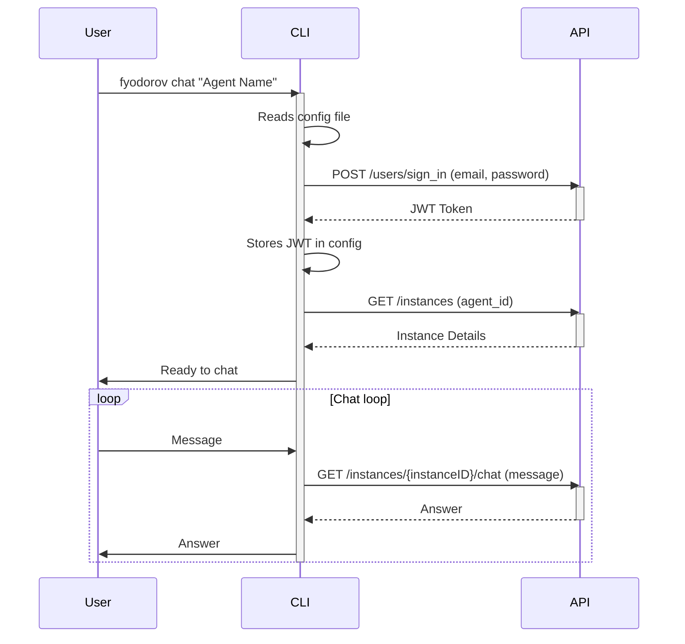
```mermaid
sequenceDiagram
    participant User
    participant CLI
    participant API

    User->>CLI: fyodorov chat "Agent Name"
    activate CLI
    CLI->>CLI: Reads config file
    CLI->>API: POST /users/sign_in (email, password)
    activate API
    API-->>CLI: JWT Token
    deactivate API
    CLI->>CLI: Stores JWT in config
    CLI->>API: GET /instances (agent_id)
    activate API
    API-->>CLI: Instance Details
    deactivate API
    CLI->>User: Ready to chat
    loop Chat loop
        User->>CLI: Message
        CLI->>API: GET /instances/{instanceID}/chat (message)
        activate API
        API-->>CLI: Answer
        deactivate API
        CLI->>User: Answer
    end
    deactivate CLI
```

The sequence diagram illustrates the authentication and chat flow. The CLI reads the configuration, authenticates with the API, retrieves instance details, and then enters a loop to send and receive messages. Sources: [cmd/cli/chat_commands.go:42-47](), [internal/api-client/client.go:52-85]().

## Instance Management

The `chat` command manages agent instances, ensuring that an instance is available for chatting. If no instances are found for the specified agent, the command creates a default instance. This simplifies the process for users who haven't explicitly created instances. Sources: [cmd/cli/chat_commands.go:89-117]().

### Instance Creation

If no instances exist for an agent, a default instance is created with a title like "Default Instance (agent ID)". The instance's `AgentId` is set to the agent's ID. The created instance is then appended to the list of instances. Sources: [cmd/cli/chat_commands.go:99-117]().

```go
instance := common.Instance{
	AgentId: agent.ID,
	Title:   fmt.Sprintf("Default Instance (%d)", agent.ID),
}
```

This code snippet shows how a default instance is created with the agent's ID and a default title. Sources: [cmd/cli/chat_commands.go:100-103]().

## Chat Request

The core functionality of the `chat` command is sending chat requests to the Fyodorov platform and displaying the agent's responses. The command takes user input from the standard input, sends it to the API, and prints the agent's answer to the standard output. Sources: [cmd/cli/chat_commands.go:134-177]().

### Request Structure

The chat request is structured as a JSON object with an "input" field containing the user's message.

```go
type ChatRequest struct {
	Input string `json:"input"`
}
```

This code snippet defines the `ChatRequest` struct, which is used to marshal the user's input into a JSON object. Sources: [cmd/cli/chat_commands.go:212-214]().

### Response Structure

The chat response from the API is expected to be a JSON object with an "answer" field containing the agent's response.

```go
type ChatResponse struct {
	Answer string `json:"answer"`
}
```

This code snippet defines the `ChatResponse` struct, which is used to unmarshal the agent's response from the JSON object. Sources: [cmd/cli/chat_commands.go:216-218]().

### Chat Flow

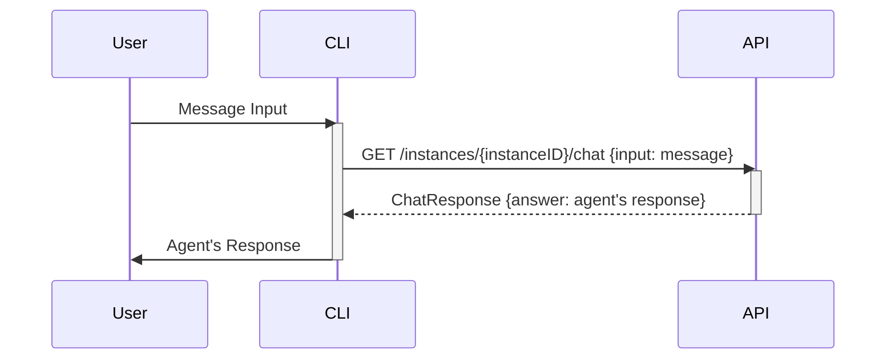
```mermaid
sequenceDiagram
    participant User
    participant CLI
    participant API

    User->>CLI: Message Input
    activate CLI
    CLI->>API: GET /instances/{instanceID}/chat {input: message}
    activate API
    API-->>CLI: ChatResponse {answer: agent's response}
    deactivate API
    CLI->>User: Agent's Response
    deactivate CLI
```

This diagram illustrates the flow of a chat request from the user to the API and back. The user inputs a message, the CLI sends it to the API, and the API returns the agent's response. Sources: [cmd/cli/chat_commands.go:134-177]().

### Loading Animation

While waiting for the API to respond, the `chat` command displays a loading animation to provide visual feedback to the user. The animation consists of a sequence of frames that are printed to the console. Sources: [cmd/cli/chat_commands.go:186-208]().

```go
func animateLoading(stop chan bool) {
	frames := []string{"...", "..", "."}
	for {
		for _, frame := range frames {
			select {
			case <-stop:
				// Clear the line and exit the animation
				fmt.Print("\r\033[K")
				return
			default:
				// Print the current frame
				fmt.Print("\r\033[K")
				fmt.Printf("\r%s", frame)
				time.Sleep(500 * time.Millisecond) // Adjust speed as needed
			}
		}
	}
}
```

This code snippet shows the `animateLoading` function, which displays the loading animation. The function prints a sequence of frames to the console until it receives a signal to stop. Sources: [cmd/cli/chat_commands.go:186-208]().

## Configuration

The `chat` command relies on the Fyodorov CLI tool's configuration for authentication and API endpoint information. The configuration is managed using the `viper` library, which allows the tool to read configuration values from a file, environment variables, and command-line flags. Sources: [cmd/cli/main.go](), [internal/common/cli_config.go]().

### Configuration File

The configuration file is stored in the platform-specific base path (e.g., `$HOME/.fyodorov` on Linux/macOS, `$LOCALAPPDATA/fyodorov` on Windows). The file contains information such as the Gagarin URL, email, password, and JWT token. Sources: [internal/common/cli_config.go:57-69]().

### Configuration Values

The following table summarizes the key configuration values used by the `chat` command:

| Configuration Key | Description                                                                                                | Source                                    |
| ----------------- | ---------------------------------------------------------------------------------------------------------- | ----------------------------------------- |
| `gagarin-url`     | The base URL for the Gagarin API.                                                                        | [internal/common/cli_config.go:84]()      |
| `email`           | The user's email address for authentication.                                                               | [internal/common/cli_config.go:87]()      |
| `password`        | The user's password for authentication.                                                                    | [internal/common/cli_config.go:90]()      |
| `jwt`             | The JSON Web Token (JWT) used for authentication.                                                          | [internal/common/cli_config.go:30]()      |
| `time_of_last_jwt_update` | The timestamp of the last JWT update.                                                                  | [internal/common/cli_config.go:31]()      |

### Retrieving Resources

The `GetResources` function fetches resources (agents, models, providers, tools, instances) from the API. It caches the resources to improve performance and reduce API calls. The cache is stored in a YAML file. Sources: [cmd/cli/resource_commands.go:43-76](), [internal/api-client/client.go:153-182](), [internal/common/fyodorov_config.go]().

```go
func GetResources() *common.FyodorovConfig {
	cache.Update(false)
	return cache.Resources
}
```

This code snippet shows how the `GetResources` function retrieves resources from the cache or the API. The `cache.Update` function checks if the cache is expired and updates it if necessary. Sources: [cmd/cli/resource_commands.go:149-152]().

## Error Handling

The `chat` command includes error handling to gracefully manage potential issues such as authentication failures, API request errors, and invalid responses.  Error messages are printed to the standard error stream. Sources: [cmd/cli/chat_commands.go:45-47](), [cmd/cli/chat_commands.go:149-151](), [cmd/cli/chat_commands.go:169-171]().

## Conclusion

The `fyodorov chat` command provides a user-friendly interface for interacting with deployed agents from the command line. It handles authentication, instance management, and chat requests, streamlining the agent development and deployment workflow. The command's configuration options and error handling contribute to its usability and robustness.


---

<a id='features-resource-management'></a>

## Resource Management

### Related Pages

Related topics: [Configuration Details](#configuration-details)

<details>
<summary>Relevant source files</summary>

The following files were used as context for generating this wiki page:

- [cmd/cli/resource_commands.go](cmd/cli/resource_commands.go)
- [internal/api-client/client.go](internal/api-client/client.go)
- [internal/common/fyodorov_config.go](internal/common/fyodorov_config.go)
- [cmd/cli/commands.go](cmd/cli/commands.go)
- [cmd/cli/deploy_commands.go](cmd/cli/deploy_commands.go)
- [internal/common/agent.go](internal/common/agent.go)
- [internal/common/mcp_tool.go](internal/common/mcp_tool.go)
</details>

# Resource Management

Resource Management in this project revolves around handling different types of deployable resources, such as models, agents, tools, providers, and instances. It includes listing, removing, and deploying these resources, as well as managing their configurations. The system uses a cache to store resource information and interacts with an API to manage the resources. [Introduction: cmd/cli/resource_commands.go]().

## Resource Types

The project manages several resource types, including models, agents, tools, providers, and instances. These resource types are defined as an enumeration for validation and command-line argument completion.  `resourceTypes = common.Enum{"models", "agents", "tools", "providers", "instances"}`.  [cmd/cli/resource_commands.go:21](), [main.go:15]().

## Listing Resources

The `listResourcesCmd` command is used to list deployed resources for a user. It supports listing all resources or filtering by specific resource types. The command fetches resources, marshals them into YAML format, and prints them to standard output. [cmd/cli/resource_commands.go](), [main.go]().

### Listing Process

The listing process involves the following steps:

1.  **Fetching Resources:** The `GetResources()` function retrieves the resources, potentially updating the cache if it's expired. [cmd/cli/resource_commands.go:58](), [main.go:107]().
2.  **Filtering (Optional):** If resource types are specified as arguments, the command filters the resources based on these types. [cmd/cli/resource_commands.go:61-77]().
3.  **Marshaling to YAML:** The selected resources are marshaled into YAML format using the `yaml.Marshal()` function. [cmd/cli/resource_commands.go:68-77]().
4.  **Printing to Standard Output:** The YAML representation of the resources is printed to standard output. [cmd/cli/resource_commands.go:78]().

```go
fmt.Printf("\033[36m---%s resources---:\033[0m\n", strings.Title(resourceType))
fmt.Printf("%s\n", string(bytes))
```

Sources: [cmd/cli/resource_commands.go:77-78]().

### Resource Listing Flow

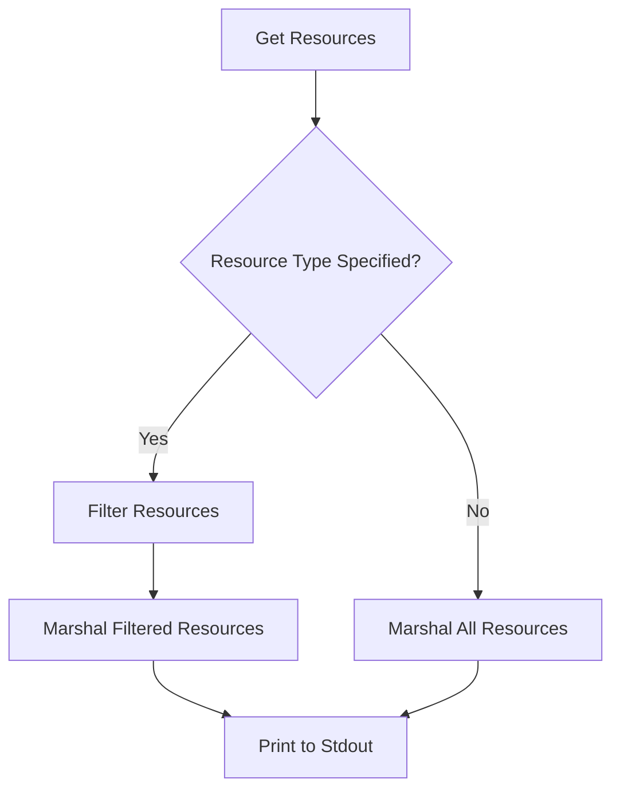
```mermaid
graph TD
    A[Get Resources] --> B{Resource Type Specified?};
    B -- Yes --> C[Filter Resources];
    B -- No --> D[Marshal All Resources];
    C --> E[Marshal Filtered Resources];
    E --> F[Print to Stdout];
    D --> F;
```

The flowchart illustrates the process of listing resources, showing the conditional filtering based on user input. [cmd/cli/resource_commands.go:58-78]().

## Removing Resources

The `removeResourcesCmd` command is used to remove deployed resources for a user. It requires specifying the resource type and the handles of the resources to remove. [cmd/cli/resource_commands.go]().

### Removal Process

The removal process consists of these steps:

1.  **Parsing Arguments:** The command parses the arguments to determine the resource type and resource handles. [cmd/cli/resource_commands.go:99-107]().
2.  **Validating Resource Type:** The command validates that the specified resource type is valid. [cmd/cli/resource_commands.go:103-107]().
3.  **Resolving Resource IDs:** The command resolves the resource handles to resource IDs using the `GetResourceIDByString()` function. [cmd/cli/resource_commands.go:113-131]().
4.  **Deleting Resources:** The command calls the `DeleteResources()` function to delete the resources from the system. [cmd/cli/resource_commands.go:132]().

### Resource ID Retrieval

The `GetResourceIDByString` function retrieves the ID of a resource based on its type and string representation. It iterates through the resources of the specified type and compares their string representations to the provided string. [cmd/cli/resource_commands.go:138-176]().

```go
func GetResourceIDByString(resources *common.FyodorovConfig, resourceType string, resourceString string) int64 {
	switch resourceType {
	case "models":
		for _, resource := range resources.Models {
			if resource.String() == resourceString {
				return resource.ID
			}
		}
  // ... other cases
	}
	return -1
}
```

Sources: [cmd/cli/resource_commands.go:138-176]().

### Resource Deletion

The `DeleteResources` function iterates through a list of resources and calls the `DeleteResource` function for each resource to remove it. After deleting all resources, it updates the cache. [cmd/cli/resource_commands.go:180-185]().

```go
func DeleteResources(resourceType string, resources []common.BaseModel) error {
	for _, resource := range resources {
		DeleteResource(resourceType, resource.GetID())
	}
	cache.Update(true)
	return nil
}
```

Sources: [cmd/cli/resource_commands.go:180-185]().

The `DeleteResource` function constructs an API client, authenticates, and calls the API to delete a specific resource. It handles tools differently, using the Tsiolkovsky URL if the resource type is "tools". [cmd/cli/resource_commands.go:187-230]().

```go
func DeleteResource(resourceType string, resourceId int64) {
	var client *api.APIClient
	var err error
	if resourceType == "tools" {
		if !v.IsSet("tsiolkovsky-url") {
			fmt.Println("\033[33mTsiolkovsky URL is not set in config\033[0m")
			return
		}
		client, err = api.NewAPIClient(v, v.GetString("tsiolkovsky-url"))
	} else {
		client, err = api.NewAPIClient(v, v.GetString("gagarin-url"))
	}
  // ...
}
```

Sources: [cmd/cli/resource_commands.go:187-230]().

### Resource Deletion Sequence

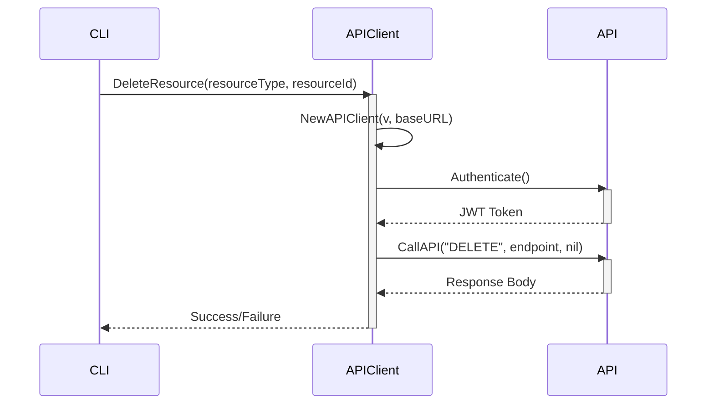
```mermaid
sequenceDiagram
    participant CLI
    participant APIClient
    participant API
    CLI->>APIClient: DeleteResource(resourceType, resourceId)
    activate APIClient
    APIClient->>APIClient: NewAPIClient(v, baseURL)
    APIClient->>API: Authenticate()
    activate API
    API-->>APIClient: JWT Token
    deactivate API
    APIClient->>API: CallAPI("DELETE", endpoint, nil)
    activate API
    API-->>APIClient: Response Body
    deactivate API
    APIClient-->>CLI: Success/Failure
    deactivate APIClient
```

The sequence diagram illustrates the steps involved in deleting a resource, including authentication and API calls. [cmd/cli/resource_commands.go:187-230](), [internal/api-client/client.go]().

## Resource Caching

The project uses a cache to store resource information, reducing the need to fetch resources from the API repeatedly. The `Cache` struct holds the resources and the file name where the cache is stored. [main.go:18-24]().

### Cache Structure

```go
type Cache struct {
	Viper     *viper.Viper
	Resources *common.FyodorovConfig
	FileName  string
	Mutex     sync.Mutex
}
```

Sources: [main.go:18-24]().

### Cache Update

The `Update()` method updates the cache. It reads the cache from a file, checks if the cache is expired, and if so, fetches the resources from the API and writes them back to the cache file. [main.go:30-50]().

```go
func (cache *Cache) Update(forceUpdate bool) {
	cache.Mutex.Lock()
	defer cache.Mutex.Unlock()
	cache.ReadCacheFromFile()
	if cache.Resources.IsExpired(v) || NoCache || forceUpdate {
		cache.Resources = getResources(nil)
		t := time.Now()
		cache.Resources.TimeOfLastCacheUpdate = &t
		yamlBytes, err := yaml.Marshal(cache.Resources)
		if err != nil {
			fmt.Printf("Error marshaling fyodorov config to yaml for cache: %v\n", err)
			return
		}
		err = os.WriteFile(cache.FileName, yamlBytes, 0644)
		if err != nil {
			fmt.Printf("Error writing cache file (%s): %v\n", cache.FileName, err)
			return
		}
	}
}
```

Sources: [main.go:30-50]().

### Cache Read

The `ReadCacheFromFile()` method reads the cache from the specified file and unmarshals it into the `Resources` field of the `Cache` struct. [main.go:52-65]().

```go
func (cache *Cache) ReadCacheFromFile() error {
	fileBytes, err := os.ReadFile(cache.FileName)
	if err != nil {
		fmt.Printf("Error reading cache file (%s): %v\n", cache.FileName, err)
		return err
	}
	err = yaml.Unmarshal(fileBytes, &cache.Resources)
	if err != nil {
		fmt.Printf("Error unmarshaling cache: %v\n", err)
		return err
	}
	return nil
}
```

Sources: [main.go:52-65]().

## Resource Deployment

The `deployTemplateCmd` command is used to deploy resources from a YAML file. It reads the configuration from the file, validates it, and sends it to the API for deployment. [cmd/cli/deploy_commands.go]().

### Deployment Process

The deployment process involves the following steps:

1.  **Loading Configuration:** The command loads the configuration from the specified YAML file using the `common.LoadConfig` function. [cmd/cli/deploy_commands.go:64](), [internal/common/generic.go]().
2.  **Parsing Key-Value Pairs:** The command parses any key-value pairs provided via the `--set` flag and applies them to the configuration. [cmd/cli/deploy_commands.go:68](), [internal/common/value_parser.go]().
3.  **Validating Configuration:** The command validates the configuration using the `Validate()` method of the `FyodorovConfig` struct. [cmd/cli/deploy_commands.go:72](), [internal/common/fyodorov_config.go]().
4.  **Sending to API:** The command marshals the configuration to YAML and sends it to the API using the `CallAPI` function. [cmd/cli/deploy_commands.go:95](), [internal/api-client/client.go]().

### Configuration Loading

The `common.LoadConfig` function loads a configuration from a file. It supports both JSON and YAML formats and automatically expands environment variables within the file. [internal/common/generic.go]().

```go
func LoadConfig[T any](filename string) (*T, error) {
	fileBytes, err := os.ReadFile(filename)
	if err != nil {
		return nil, err
	}

	// Expand environment variables in the file contents
	//  Any ${FOO} will be replaced with os.Getenv("FOO")
	expanded := os.ExpandEnv(string(fileBytes))

	var config T
	switch filepath.Ext(filename) {
	case ".json":
		if err := json.Unmarshal([]byte(expanded), &config); err != nil {
			fmt.Printf("\033[33mError unmarshaling json config from file %s:\n  %v\n\033[0m", filename, err)
			return nil, err
		}
	case ".yaml", ".yml":
		dec := yaml.NewDecoder(bytes.NewReader([]byte(expanded)))
		dec.KnownFields(true) // ← reject any unknown fields
		if err := dec.Decode(&config); err != nil {
			fmt.Printf("\033[33mError unmarshaling yaml config from file %s:\n  %v\n\033[0m", filename, err)
			return nil, err
		}
	default:
		fmt.Printf("\033[33mError loading config from unsupported file format %s:\n  %v\n\033[0m", filename, err)
		return nil, fmt.Errorf("unsupported file format")
	}

	return &config, nil
}
```

Sources: [internal/common/generic.go]().

### Configuration Validation

The `Validate()` method of the `FyodorovConfig` struct validates the configuration. It checks the version, providers, models, agents and tools for validity. [internal/common/fyodorov_config.go]().

```go
func (config *FyodorovConfig) Validate() error {
	if config.Version != nil && *config.Version != "" {
		// check if version is in valid semver format
		if _, err := semver.NewVersion(*config.Version); err != nil {
			return err
		}
	}
	if config.Providers != nil {
		for _, provider := range config.Providers {
			if err := provider.Validate(); err != nil {
				return err
			}
		}
	}
  // ...
	return nil
}
```

Sources: [internal/common/fyodorov_config.go]().

### Configuration Deployment Sequence

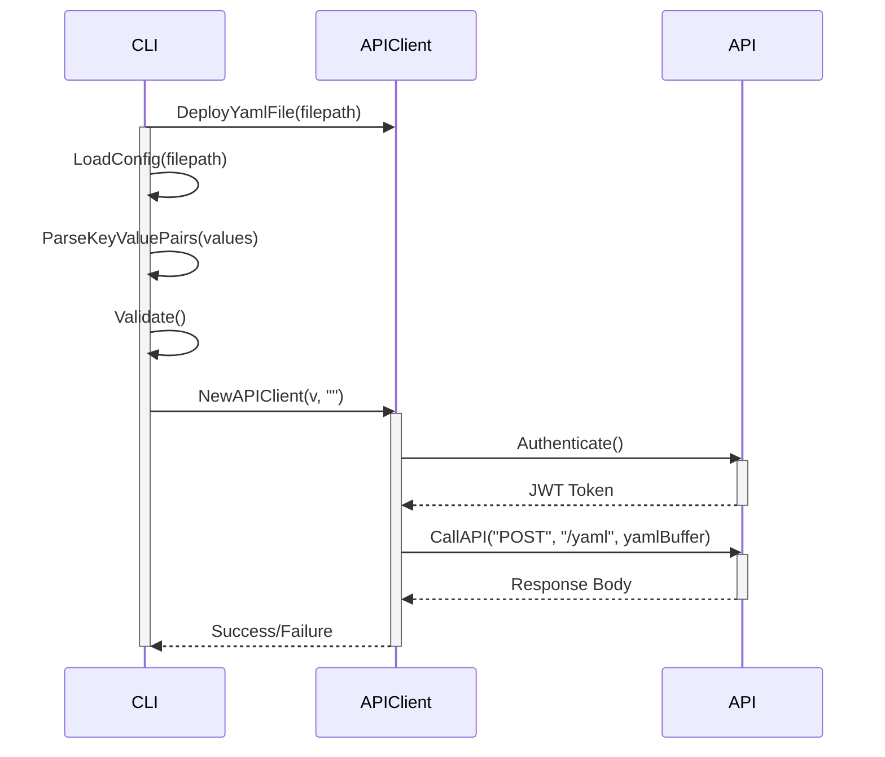
```mermaid
sequenceDiagram
    participant CLI
    participant APIClient
    participant API
    CLI->>APIClient: DeployYamlFile(filepath)
    activate CLI
    CLI->>CLI: LoadConfig(filepath)
    CLI->>CLI: ParseKeyValuePairs(values)
    CLI->>CLI: Validate()
    CLI->>APIClient: NewAPIClient(v, "")
    activate APIClient
    APIClient->>API: Authenticate()
    activate API
    API-->>APIClient: JWT Token
    deactivate API
    APIClient->>API: CallAPI("POST", "/yaml", yamlBuffer)
    activate API
    API-->>APIClient: Response Body
    deactivate API
    APIClient-->>CLI: Success/Failure
    deactivate APIClient
    deactivate CLI
```

The sequence diagram illustrates the steps involved in deploying a configuration, including loading, validating, and sending it to the API. [cmd/cli/deploy_commands.go](), [internal/api-client/client.go](), [internal/common/generic.go](), [internal/common/value_parser.go](), [internal/common/fyodorov_config.go]().

## Conclusion

Resource management is a critical aspect of the project, enabling the deployment, removal, and listing of various resource types. The system employs caching to optimize performance and interacts with an API to manage resources. The `fyodorov` CLI tool provides commands to facilitate these operations.


---

<a id='configuration-details'></a>

## Configuration Details

### Related Pages

Related topics: [Configuration Validation](#configuration-validation), [Configuration Deployment](#features-deployment)

<details>
<summary>Relevant source files</summary>

The following files were used as context for generating this wiki page:

- [cmd/cli/commands.go](cmd/cli/commands.go)
- [cmd/cli/deploy_commands.go](cmd/cli/deploy_commands.go)
- [internal/common/fyodorov_config.go](internal/common/fyodorov_config.go)
- [internal/common/generic.go](internal/common/generic.go)
- [cmd/cli/main.go](cmd/cli/main.go)
- [internal/common/cli_config.go](internal/common/cli_config.go)
</details>

# Configuration Details

The Fyodorov CLI tool relies on configuration files to define providers, models, agents, tools, and instances. These configurations are typically stored in YAML files and can be deployed to the Fyodorov platform. The CLI tool provides commands to validate, deploy, and manage these configurations. This page details the structure of these configuration files, how they are loaded and validated, and how they interact with the Fyodorov CLI tool.  The configuration also manages authentication details required to communicate with the Fyodorov platform.

## Configuration File Structure

The Fyodorov configuration is defined using a `FyodorovConfig` struct, which includes fields for versioning, providers, models, agents, tools, and instances. This configuration is typically stored in YAML or JSON format.  The tool uses the file extension to determine how to parse the config file [internal/common/generic.go:21-23]().

### FyodorovConfig

The `FyodorovConfig` struct contains the overall structure of the configuration file.

```go
type FyodorovConfig struct {
	Version               *string       `json:"version" yaml:"version,omitempty"`
	Providers             []Provider    `json:"providers,omitempty" yaml:"providers,omitempty"`
	Models                []ModelConfig `json:"models,omitempty" yaml:"models,omitempty"`
	Agents                []Agent       `json:"agents,omitempty" yaml:"agents,omitempty"`
	Tools                 []MCPTool     `json:"tools,omitempty" yaml:"tools,omitempty"`
	Instances             []Instance    `json:"instances,omitempty" yaml:"instances,omitempty"`
	TimeOfLastCacheUpdate *time.Time    `json:"time_of_last_cache_update,omitempty" yaml:"time_of_last_cache_update,omitempty"`
}
```
Sources: [internal/common/fyodorov_config.go:9-16]()

This struct is central to defining the desired state of the Fyodorov platform, specifying the components and their configurations.

### Providers

Providers define the AI service providers, such as OpenAI, that the Fyodorov platform will use.

```go
type Provider struct {
	ID     int64  `json:"id,omitempty" yaml:"id,omitempty"`
	Name   string `json:"name,omitempty" yaml:"name,omitempty"`
	URL    string `json:"api_url,omitempty" yaml:"api_url,omitempty"`
	APIKey string `json:"api_key,omitempty" yaml:"api_key,omitempty"`
}
```
Sources: [internal/common/provider.go:7-12]()

### Models

Models define the specific AI models to be used, linking them to a provider.

```go
type ModelConfig struct {
	ID       int64       `json:"id,omitempty" yaml:"id,omitempty"`
	Name     string      `json:"name,omitempty" yaml:"name,omitempty"`
	Provider string      `json:"provider,omitempty" yaml:"provider,omitempty"`
	ModelInfo ModelInfo `json:"model_info,omitempty" yaml:"model_info,omitempty"`
	Params   interface{} `json:"params,omitempty" yaml:"params,omitempty"`
}
```
Sources: [internal/common/model.go:10-16]()

### Agents

Agents define the AI agents that will be deployed, specifying their model and prompt.

```go
type Agent struct {
	ID          int64  `json:"id,omitempty" yaml:"id,omitempty"`
	Name        string `json:"name,omitempty" yaml:"name,omitempty"`
	Description string `json:"description,omitempty" yaml:"description,omitempty"`
	Model       string `json:"model,omitempty" yaml:"model,omitempty"`
	Prompt      string `json:"prompt,omitempty" yaml:"prompt,omitempty"`
}
```
Sources: [internal/common/agent.go:7-13]()

### Tools

Tools define external tools that the AI agents can use.

```go
type Tool struct {
	NameForHuman     string `json:"name" yaml:"name,omitempty"`
	NameForAI        string `json:"name_for_ai" yaml:"name_for_ai,omitempty"`
	Description      string `json:"description" yaml:"description,omitempty"`
	DescriptionForAI string `json:"description_for_ai" yaml:"description_for_ai,omitempty"`
	API              struct {
		Type string `json:"type" yaml:"type,omitempty"`
		URL  string `json:"url" yaml:"url,omitempty"`
	} `json:"api" yaml:"api,omitempty"`
	LogoURL      string `json:"logo_url" yaml:"logo_url,omitempty"`
	ContactEmail string `json:"contact_email" yaml:"contact_email,omitempty"`
	LegalInfoURL string `json:"legal_info_url" yaml:"legal_info_url,omitempty"`
	// Include fields from the 'auth' structure if needed
	Auth struct {
		Type string `json:"type" yaml:"type,omitempty"`
	} `json:"auth" yaml:"auth,omitempty"`
}
```
Sources: [internal/common/tool.go:3-21]()

### Instances

Instances represent specific deployments of agents.

```go
type Instance struct {
	ID      int64  `json:"id,omitempty" yaml:"id,omitempty"`
	Title   string `json:"title,omitempty" yaml:"title,omitempty"`
	AgentId int64  `json:"agent_id,omitempty" yaml:"agent_id,omitempty"`
}
```
Sources: [internal/common/fyodorov_config.go:18-22]()

## Configuration Loading and Validation

The Fyodorov CLI tool uses the `LoadConfig` function to load configuration files from YAML or JSON format. The tool also validates the configuration to ensure that it is correct and complete.

### LoadConfig Function

The `LoadConfig` function reads a configuration file, expands environment variables within the file, and unmarshals the content into a struct [internal/common/generic.go:21-45]().

```go
func LoadConfig[T any](filename string) (*T, error) {
	fileBytes, err := os.ReadFile(filename)
	if err != nil {
		return nil, err
	}

	// Expand environment variables in the file contents
	//  Any ${FOO} will be replaced with os.Getenv("FOO")
	expanded := os.ExpandEnv(string(fileBytes))

	var config T
	switch filepath.Ext(filename) {
	case ".json":
		if err := json.Unmarshal([]byte(expanded), &config); err != nil {
			fmt.Printf("\033[33mError unmarshaling json config from file %s:\n  %v\n\033[0m", filename, err)
			return nil, err
		}
	case ".yaml", ".yml":
		dec := yaml.NewDecoder(bytes.NewReader([]byte(expanded)))
		dec.KnownFields(true) // ← reject any unknown fields
		if err := dec.Decode(&config); err != nil {
			fmt.Printf("\033[33mError unmarshaling yaml config from file %s:\n  %v\n\033[0m", filename, err)
			return nil, err
		}
	default:
		fmt.Printf("\033[33mError loading config from unsupported file format %s:\n  %v\n\033[0m", filename, err)
		return nil, fmt.Errorf("unsupported file format")
	}

	return &config, nil
}
```
Sources: [internal/common/generic.go:23-45]()

### Validate Method

The `Validate` method, defined on the `FyodorovConfig` struct, checks the configuration for correctness. This includes verifying the version format and validating individual providers, models, agents, and tools [internal/common/fyodorov_config.go:70-94]().

```go
func (config *FyodorovConfig) Validate() error {
	if config.Version != nil && *config.Version != "" {
		// check if version is in valid semver format
		if _, err := semver.NewVersion(*config.Version); err != nil {
			return err
		}
	}
	if config.Providers != nil {
		for _, provider := range config.Providers {
			if err := provider.Validate(); err != nil {
				return err
			}
		}
	}
	if config.Models != nil {
		for _, model := range config.Models {
			if err := model.Validate(); err != nil {
				return err
			}
		}
	}
	if config.Agents != nil {
		for _, agent := range config.Agents {
			if err := agent.Validate(); err != nil {
				return err
			}
		}
	}
	if config.Tools != nil {
		for _, tool := range config.Tools {
			if err := tool.Validate(); err != nil {
				return err
			}
		}
	}
	return nil
}
```
Sources: [internal/common/fyodorov_config.go:70-94]()

### Validate Template Command

The `validateTemplateCmd` command uses the `validateYamlFile` function to load and validate a Fyodorov configuration file. It checks for loading errors, unknown fields, and overall config validity [cmd/cli/commands.go:31-58]().

```go
var validateTemplateCmd = &cobra.Command{
	Use:   "validate file [file1 file2 ...]",
	Short: "Validate a Fyodorov configuration",
	ValidArgsFunction: func(cmd *cobra.Command, args []string, toComplete string) ([]string, cobra.ShellCompDirective) {
		return []string{"yaml", "yml"}, cobra.ShellCompDirectiveFilterFileExt
	},
	Run: func(cmd *cobra.Command, args []string) {
		var wg sync.WaitGroup
		for _, arg := range args {
			wg.Add(1)
			go func(arg string) {
				defer wg.Done()
				validateYamlFile(arg)
			}(arg)
		}
		wg.Wait()
	},
}
```
Sources: [cmd/cli/commands.go:31-45]()

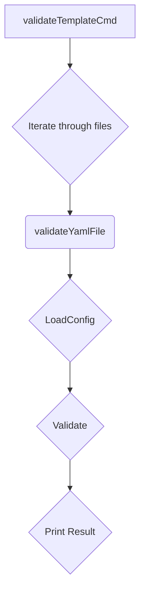
```mermaid
graph TD
    A[validateTemplateCmd] --> B{Iterate through files};
    B --> C(validateYamlFile);
    C --> D{LoadConfig};
    D --> E{Validate};
    E --> F{Print Result};
```
Sources: [cmd/cli/commands.go:31-58](), [internal/common/generic.go:21-45](), [internal/common/fyodorov_config.go:70-94]()

The diagram above illustrates the data flow during the validation process, starting from the command invocation to printing the validation result.

## Configuration Deployment

The Fyodorov CLI tool uses the `deployTemplateCmd` command to deploy configuration files to the Fyodorov platform. This command loads the configuration, validates it, and sends it to the Gagarin API.

### Deploy Template Command

The `deployTemplateCmd` command handles the deployment of Fyodorov configuration files. It supports dry runs and setting values via command-line arguments [cmd/cli/deploy_commands.go:22-40]().

```go
var deployTemplateCmd = &cobra.Command{
	Use:   "deploy file [file1 file2 ...]",
	Short: "Deploy a Fyodorov configuration",
	ValidArgsFunction: func(cmd *cobra.Command, args []string, toComplete string) ([]string, cobra.ShellCompDirective) {
		return []string{"yaml", "yml"}, cobra.ShellCompDirectiveFilterFileExt
	},
	Run: func(cmd *cobra.Command, args []string) {
		var wg sync.WaitGroup

		// Allow deploying multiple configs passed as arguments
		for _, arg := range args {
			wg.Add(1)
			go func(arg string) {
				defer wg.Done()
				deployYamlFile(arg)
			}(arg)
		}
		cache.Update(true)
		wg.Wait()
	},
}
```
Sources: [cmd/cli/deploy_commands.go:22-40]()

### DeployYamlFile Function

The `deployYamlFile` function loads, validates, and deploys a Fyodorov configuration file. It supports dry runs, where the validated config is printed to stdout, and actual deployments to the Gagarin API [cmd/cli/deploy_commands.go:42-101]().

```go
func deployYamlFile(filepath string) {
	FyodorovConfig, err := common.LoadConfig[common.FyodorovConfig](filepath)
	if err != nil {
		fmt.Printf("\033[33mError loading fyodorov config from file %s: %v\n\033[0m", filepath, err)
		return
	}
	// load fyodorov config from values
	if len(values) > 0 {
		FyodorovConfig.ParseKeyValuePairs(values)
	}
	// validate fyodorov config
	err = FyodorovConfig.Validate()
	if err != nil {
		fmt.Printf("\033[33mError validating fyodorov config (%s): %v\n\033[0m", filepath, err)
		return
	}
	// print fyodorov config to stdout
	if dryRun {
		bytes, err := yaml.Marshal(FyodorovConfig)
		if err != nil {
			fmt.Printf("\033[33mError marshaling fyodorov config to yaml: %v\n\033[0m", err)
			return
		}
		// Print the YAML to stdout
		fmt.Printf("\033[36mValidated config %s\033[0m\n", filepath)
		fmt.Printf("---Fyodorov config---\n%s\n", string(bytes))
		return
	}
	// deploy config to Gagarin
	if !dryRun {
		yamlBytes, err := yaml.Marshal(FyodorovConfig)
		if err != nil {
			fmt.Printf("\033[34mError marshaling config to yaml: %v\n\033[0m", err)
			return
		}
		client, err := api.NewAPIClient(v, "")
		if err != nil {
			return
		}
		err = client.Authenticate()
		if err != nil {
			fmt.Println("\033[33mError authenticating during deploy:\033[0m", err)
			fmt.Println("\033[33mUnable to authenticate with this config\033[0m")
			return
		}
		var yamlBuffer bytes.Buffer
		yamlBuffer.Write(yamlBytes)
		res, err := client.CallAPI("POST", "/yaml", &yamlBuffer)
		if err != nil {
			fmt.Printf("\033[33mError deploying config (%s): %v\n\033[0m", filepath, err.Error())
			return
		}
		defer res.Close()
		body, err := io.ReadAll(res)
		if err != nil {
			fmt.Printf("\033[33mError reading response body while deploying config: %v\n\033[0m", err)
			return
		}
		var bodyResponse BodyResponse
		err = json.Unmarshal(body, &bodyResponse)
		if err != nil {
			fmt.Printf("\033[33mError unmarshaling response body while deploying config (%s): %s\n\t%v\n\033[0m", filepath, string(body), err)
			return
		}
		// Print deployed config
		fmt.Printf("\033[36mDeployed config %s\033[0m\n", filepath)
	}
}
```
Sources: [cmd/cli/deploy_commands.go:42-101]()

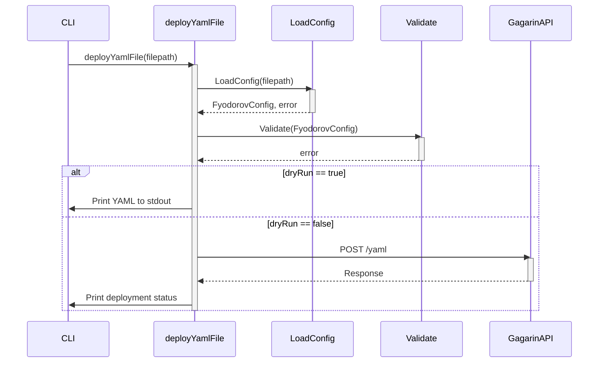
```mermaid
sequenceDiagram
    participant CLI
    participant deployYamlFile
    participant LoadConfig
    participant Validate
    participant GagarinAPI

    CLI->>deployYamlFile: deployYamlFile(filepath)
    activate deployYamlFile
    deployYamlFile->>LoadConfig: LoadConfig(filepath)
    activate LoadConfig
    LoadConfig-->>deployYamlFile: FyodorovConfig, error
    deactivate LoadConfig
    deployYamlFile->>Validate: Validate(FyodorovConfig)
    activate Validate
    Validate-->>deployYamlFile: error
    deactivate Validate
    alt dryRun == true
        deployYamlFile->>CLI: Print YAML to stdout
    else dryRun == false
        deployYamlFile->>GagarinAPI: POST /yaml
        activate GagarinAPI
        GagarinAPI-->>deployYamlFile: Response
        deactivate GagarinAPI
        deployYamlFile->>CLI: Print deployment status
    end
    deactivate deployYamlFile
```
Sources: [cmd/cli/deploy_commands.go:42-101](), [internal/common/generic.go:21-45](), [internal/common/fyodorov_config.go:70-94]()

This sequence diagram illustrates the steps involved in deploying a configuration file, including loading, validating, and sending the configuration to the Gagarin API.

## Command-Line Configuration

The Fyodorov CLI tool uses the `spf13/cobra` and `spf13/viper` libraries to handle command-line arguments and configuration settings.  Global flags are defined in `cmd/cli/main.go` [cmd/cli/main.go:25-31]().

### Global Flags

The CLI tool defines several global flags that can be used to configure its behavior.

| Flag          | Shorthand | Description                                  |
|---------------|-----------|----------------------------------------------|
| `--gagarin-url` | `-b`      | Base URL for 'Gagarin'                       |
| `--tsiolkovsky-url` | `-t`      | Base URL for 'Tsiolkovsky'                   |
| `--email`       | `-u`      | Email for authentication                     |
| `--password`    | `-p`      | Password for authentication                  |
| `--no-cache`    | `-n`      | Disable cache                                |

Sources: [cmd/cli/main.go:34-39]()

### Environmental Variables

For each flag, there is a corresponding environmental variable, which is in ALL CAPS and replaces each `-` with an `_`. For example, the environmental variable for `--gagarin-url` is `FYODOROV_GAGARIN_URL` [cmd/cli/main.go:49-54]().

### Configuration Initialization

The `initConfig` function is responsible for initializing the configuration. It reads values from the command line, environmental variables, and a configuration file. It also prompts the user for missing values, such as the Gagarin URL, email, and password [cmd/cli/main.go:74-171]().

```go
func initConfig(cmd *cobra.Command, args []string) {
	fmt.Println("CLI Version", version)
	configRun := cmd.Use == "config"
	reader := bufio.NewReader(os.Stdin)

	// Prompt for missing values
	if !v.IsSet("gagarin-url") {
		fmt.Printf("Enter Gagarin URL (default: %s): ", defaultGagarinURL)
		input, _ := reader.ReadString('\n')
		input = strings.TrimSpace(input)
		if input != "" {
			v.Set("gagarin-url", input)
		} else {
			v.Set("gagarin-url", defaultGagarinURL)
		}
	}
	if !v.IsSet("tsiolkovsky-url") {
		defaultTsiolkovskyURL := strings.Replace(v.GetString("gagarin-url"), "gagarin", "tsiolkovsky", -1)
		fmt.Printf("Enter Tsiolkovsky URL (default: %s): ", defaultTsiolkovskyURL)
		input, _ := reader.ReadString('\n')
		input = strings.TrimSpace(input)
		if input != "" {
			v.Set("tsiolkovsky-url", input)
		} else {
			v.Set("tsiolkovsky-url", defaultTsiolkovskyURL)
		}
	}
	if !v.IsSet("email") {
		fmt.Print("Enter Email: ")
		input, _ := reader.ReadString('\n')
		v.Set("email", strings.TrimSpace(input))
	}
	if !v.IsSet("password") {
		fmt.Print("Enter Password: ")
		passBytes, err := gopass.GetPasswdMasked()
		if err != nil {
			fmt.Println("Error getting password:", err)
			return
		}
		v.Set("password", strings.TrimSpace(string(passBytes)))
	}
```
Sources: [cmd/cli/main.go:74-110]()

### Config Command

The `configCmd` command is used to manage the Fyodorov configuration. It initializes the configuration using the `initConfig` function [cmd/cli/commands.go:16-24]().

```go
var configCmd = &cobra.Command{
	Use:   "config",
	Short: "Manage Fyodorov configuration",
	// Disable persistent pre-run
	PersistentPreRun: func(cmd *cobra.Command, args []string) {
	},
	Run: func(cmd *cobra.Command, args []string) {
		initConfig(cmd, args)
	},
}
```
Sources: [cmd/cli/commands.go:16-24]()

## Authentication Configuration

The Fyodorov CLI tool requires authentication to interact with the Fyodorov services. The authentication details, such as email and password, are stored in the configuration file.

### Config Struct

The `Config` struct in `internal/common/cli_config.go` defines the structure for storing authentication and other configuration details [internal/common/cli_config.go:11-20]().

```go
type Config struct {
	Version        string `json:"version"`
	GagarinURL     string `json:"gagarin_url"`
	TsiolkovskyURL string `json:"tsiolkovsky_url"`
	// DostoyevskyURL string `json:"dostoyevsky_url"`
	Email               string        `json:"email"`
	Password            string        `json:"password"`
	CacheTTL            time.Duration `json:"ttl"`
	JWT                 string        `json:"jwt"`
	TimeOfLastJWTUpdate time.Time     `json:"time_of_last_jwt_update"`
}
```
Sources: [internal/common/cli_config.go:11-20]()

### Authentication Process

The `Authenticate` method in `internal/api-client/client.go` handles the authentication process. It sends the email and password to the API and receives a JWT token, which is then stored in the configuration file [internal/api-client/client.go:48-76]().

```go
func (client *APIClient) Authenticate() error {
	if client.Viper.IsSet("jwt") && client.Viper.GetTime("time_of_last_jwt_update").Add(client.Viper.GetDuration("jwt_ttl")).After(time.Now()) {
		client.AuthToken = client.Viper.GetString("jwt")
		return nil
	}
	// Implement authentication with the API to obtain AuthToken
	body := bytes.NewBuffer([]byte{})
	json.NewEncoder(body).Encode(map[string]string{"email": client.Email, "password": client.Password})
	responseBody, err := client.CallAPI("POST", "/users/sign_in", body)
	if err != nil {
		fmt.Printf("\033[0;31mError authenticating (POST %s/users/sign_in):\033[0m +%v\n", client.BaseURL, err.Error())
		return err
	}
	var response struct {
		Message string `json:"message"`
		JWT     string `json:"jwt"`
	}
	err = json.NewDecoder(responseBody).Decode(&response)
	if err != nil {
		return err
	}
	// fmt.Println(response.Message)
	client.AuthToken = response.JWT
	client.Viper.Set("jwt", response.JWT)
	client.Viper.Set("time_of_last_jwt_update", time.Now())
	err = client.Viper.WriteConfig()
	if err != nil {
		return err
	}
	return nil
}
```
Sources: [internal/api-client/client.go:48-76]()

## Conclusion

The Fyodorov CLI tool relies on a flexible configuration system that supports YAML and JSON formats, environment variable expansion, and command-line overrides. This system allows users to define and deploy complex configurations for AI providers, models, agents, tools and instances. The tool validates the configurations before deployment, ensuring that they are correct and complete. The configuration system also handles authentication, allowing the CLI tool to securely interact with the Fyodorov platform.


---

<a id='configuration-validation'></a>

## Configuration Validation

### Related Pages

Related topics: [Configuration Details](#configuration-details)

```html
<details>
<summary>Relevant source files</summary>

The following files were used as context for generating this wiki page:

- [cmd/cli/commands.go](cmd/cli/commands.go)
- [internal/common/fyodorov_config.go](internal/common/fyodorov_config.go)
- [cmd/cli/deploy_commands.go](cmd/cli/deploy_commands.go)
- [internal/common/generic.go](internal/common/generic.go)
- [cmd/cli/main.go](cmd/cli/main.go)
- [internal/api-client/client.go](internal/api-client/client.go)
</details>

# Configuration Validation

Configuration validation is a crucial process within the fyodorov-cli tool to ensure that the configuration files provided by users are syntactically correct and semantically valid before deploying or using them. This process helps prevent runtime errors and ensures the application behaves as expected. The validation process includes checking the file format, verifying the presence and correctness of required fields, and validating the relationships between different configuration elements.

## Overview of Configuration Validation

The fyodorov-cli tool uses the `validate` command to perform configuration validation on YAML files. This command loads the configuration file, checks for structural integrity, and validates the values against predefined rules. The validation process ensures that the configuration adheres to the expected schema and constraints defined in the application.

### Validation Process

The validation process can be broken down into the following steps:

1.  **Loading the Configuration File:** The tool reads the configuration file from the specified path. It supports both JSON and YAML formats, determining the format by the file extension. Sources: [cmd/cli/commands.go:61](), [internal/common/generic.go:14-42]()
2.  **File Format Check:** The tool checks if the file is in a supported format (JSON or YAML). If the format is not supported, an error is returned. Sources: [internal/common/generic.go:43-46]()
3.  **Structural Validation:** The tool unmarshals the file content into a `FyodorovConfig` struct, checking for structural correctness. This step ensures that the file has the expected fields and data types. Sources: [cmd/cli/commands.go:75-83](), [internal/common/generic.go:29-42]()
4.  **Semantic Validation:** The tool validates the configuration values against predefined rules. This step checks if the required fields are present, if the values are within the allowed ranges, and if the relationships between different configuration elements are valid. Sources: [cmd/cli/commands.go:84-87](), [internal/common/fyodorov_config.go:85-111]()
5.  **Error Reporting:** If any validation errors are found, the tool reports them to the user, indicating the file path and the specific error message. Sources: [cmd/cli/commands.go:63-64, 77, 86]()

### Key Components

The configuration validation process involves several key components:

*   **`validateTemplateCmd`:** Cobra command that initiates the validation process. Sources: [cmd/cli/commands.go:56-70]()
*   **`validateYamlFile`:** Function that performs the actual validation of a YAML file. Sources: [cmd/cli/commands.go:72-88]()
*   **`LoadConfig`:** Generic function to load configuration from a file. Sources: [internal/common/generic.go:14-46]()
*   **`FyodorovConfig`:** Struct representing the Fyodorov configuration. Sources: [internal/common/fyodorov_config.go:9-16]()
*   **`Validate`:** Method on `FyodorovConfig` that performs semantic validation. Sources: [internal/common/fyodorov_config.go:85-111]()

## Detailed Validation Logic

The `validateYamlFile` function in `cmd/cli/commands.go` orchestrates the validation process. It loads the YAML file, checks for unknown fields, and then validates the configuration using the `Validate` method on the `FyodorovConfig` struct.

```go
func validateYamlFile(filepath string) {
	// Load the config from the file
	config, err := common.LoadConfig[common.FyodorovConfig](filepath)
	if err != nil {
		fmt.Printf("\033[33mError loading fyodorov config '%s' from file: %v\n\033[0m", filepath, err)
		return
	}

	// Load the file directly
	fileBytes, err := os.ReadFile(filepath)
	if err != nil {
		fmt.Printf("\033[33mError opening fyodorov config file '%s': %v\n\033[0m", filepath, err)
		return
	}

	// Verify there are no other fields in the file
	var cfg common.FyodorovConfig
	dec := yaml.NewDecoder(bytes.NewReader(fileBytes))
	dec.KnownFields(true) // ← reject any unknown fields
	if err := dec.Decode(&cfg); err != nil {
		fmt.Printf("invalid config %s: %v", filepath, err)
		return
	}
	// Validate the config
	if err := config.Validate(); err != nil {
		fmt.Printf("Fyodorov config '%s' is invalid: %v\n", filepath, err)
		return
	}

	fmt.Printf("\033[36mFyodorov config '%s' is valid\n\033[0m", filepath)
}
```

Sources: [cmd/cli/commands.go:72-88]()

### Checking for Unknown Fields

The `validateYamlFile` function uses the `KnownFields(true)` method of the `yaml.Decoder` to reject any unknown fields in the YAML file. This ensures that the configuration file only contains the expected fields and prevents typos or misconfigurations from causing unexpected behavior. Sources: [cmd/cli/commands.go:81-83]()

### Semantic Validation with `FyodorovConfig.Validate()`

The `Validate` method on the `FyodorovConfig` struct performs semantic validation of the configuration values. It checks the validity of the version, providers, models, agents, and tools defined in the configuration file.

```go
func (config *FyodorovConfig) Validate() error {
	if config.Version != nil && *config.Version != "" {
		// check if version is in valid semver format
		if _, err := semver.NewVersion(*config.Version); err != nil {
			return err
		}
	}
	if config.Providers != nil {
		for _, provider := range config.Providers {
			if err := provider.Validate(); err != nil {
				return err
			}
		}
	}
	if config.Models != nil {
		for _, model := range config.Models {
			if err := model.Validate(); err != nil {
				return err
			}
		}
	}
	if config.Agents != nil {
		for _, agent := range config.Agents {
			if err := agent.Validate(); err != nil {
				return err
			}
		}
	}
	if config.Tools != nil {
		for _, tool := range config.Tools {
			if err := tool.Validate(); err != nil {
				return err
			}
		}
	}
	return nil
}
```

Sources: [internal/common/fyodorov_config.go:85-111]()

### Validation of Individual Components

Each component of the `FyodorovConfig` struct (e.g., `Provider`, `ModelConfig`, `Agent`, `MCPTool`) has its own `Validate` method that performs specific validation checks for that component. For example, the `Agent.Validate()` method checks if the model, name, description, and prompt are valid. Sources: [internal/common/agent.go:21-37](), [internal/common/model.go:51-74](), [internal/common/mcp_tool.go:29-45]()

## Data Flow Diagram

The following diagram illustrates the data flow during the configuration validation process:

```mermaid
graph TD
    A[CLI Command: validate file] --> B(Load Yaml File);
    B --> C{Valid Yaml?};
    C -- Yes --> D(Unmarshal to FyodorovConfig);
    D --> E{Valid FyodorovConfig?};
    E -- Yes --> F(Print "Valid");
    E -- No --> G(Print "Invalid");
    C -- No --> H(Print "Invalid Yaml");
    F --> I([End]);
    G --> I;
    H --> I;
```

This diagram shows the high-level steps involved in validating a Fyodorov configuration file, from loading the file to printing the validation result.

## Key Functions and Data Structures

### Key Functions

| Function          | Description                                                                                                                                                                                                                                                           | Source                                  |
| ----------------- | ------------------------------------------------------------------------------------------------------------------------------------------------------------------------------------------------------------------------------------------------------------------- | --------------------------------------- |
| `validateYamlFile` | Orchestrates the validation process for a YAML file. Loads the file, checks for unknown fields, and validates the configuration.                                                                                                                                   | [cmd/cli/commands.go:72-88]()          |
| `LoadConfig`      | A generic function to load configuration from a file. It supports both JSON and YAML formats.                                                                                                                                                                      | [internal/common/generic.go:14-46]()    |
| `Validate`        | Method on `FyodorovConfig` that performs semantic validation of the configuration values. It checks the validity of the version, providers, models, agents, and tools defined in the configuration file.                                                              | [internal/common/fyodorov_config.go]() |
| `Agent.Validate`  | Method on the `Agent` struct that validates the agent's configuration, including checking for required fields like `Model`, `Name`, and `Prompt`, and ensuring that the lengths of `Name` and `Description` do not exceed the maximum allowed lengths.            | [internal/common/agent.go:21-37]()      |
| `ModelConfig.Validate` | Method on the `ModelConfig` struct that validates the model's configuration, ensuring that required fields like `Name` and `Provider` are present and that the `ModelInfo` is valid. | [internal/common/model.go:51-74]()      |
| `MCPTool.Validate`  | Method on the `MCPTool` struct that validates the tool's configuration, checking if the tool handle is present and if the LogoURL and APIURL are valid URLs.                                                                                                         | [internal/common/mcp_tool.go:29-45]()   |

### Data Structures

| Data Structure | Description                                                                                                                                                                                                                                                                                                                                                                                                                                                                                                                                                                                                                                                                                                                                                                                                                                                                                                                                                                                                                                                                                                                                                                                                                                                                                                                                                                                                                                                                                                                                                                                                                                                                                                                                                                                                                                                                                                                                                                                                                                                                                                                                                                                                                                                                                                                                                                                                                                                                                                                                                                                                                                                                                                                                                                                                                                                                                                                                                                                                                                                                                                                                                                                                                                                                                                                                                                                                                                                                                                                                                                                                                                                                                                                                                                                                                                                                                                                                                                                                                                                                                                                                                                                                                                                                                                                                                                                                                                                                                                                                                                                                                                                                                                                                                                                                                                                                                                                                                                                                                                                                                                                                                                                                                                                                                                                                                                                                                                                                                                                                                                                                                                                                                                                                                                                                                                                                                                                                                                                                                                                                                                                                                                                                                                                                                                                                                                                                                                                                                                                                                                                                                                                                                                                                                                                                                                                                                                                                                                                                                                                                                                                                                                                                                                                                                                                                                                                                                                                                                                                                                                                                                                                                                                                                                                                                                                                                                                                                                                                                                                                                                                                                                                                                                                                                                                                                                                                                                                                                                                                                                                                                                                                                                                                                                                                                                                                                                                                                                                                                                                                                                                                                                                                                                                                                                                                                                                                                                                                                                                                                                                                                                                                                                                                                                                                                                                                                                                                                                                                                                                                                                                                                                                                                                                                                                                                                                                                                                                                                                                                                                                                                                                                                                                                                                                                                                                                                                                                                                                                                                                                                                                                                                                                                                                                                                                                                                                                                                                                                                                                                                                                                                                                                                                                                                                                                                                                                                                                                                                                                                                                                                                                                                                                                                                                                                                                                                                                                                                                                                                                                                                                                                                                                                                                                                                                                                                                                                                                                                                                                                                                                                                                                                                                                                                                                                                                                                                                                                                                                                                                                                                                                                                                                                                                                                                                                                                                                                                                                                                                                                                                                                                                                                                                                                                                                                                                                                                                                                                                                                                                                                                                                                                                                                                                                                                                                                                                                                                                                                                                                                                                                                                                                                                                                                                                                                                                                                                                                                                                                                                                                                                                                                                                                                                                                                                                                                                                                                                                                                                                                                                                                                                                                                                                                                                                                                                                                                                                                                                                                                                                                                                                                                                                                                                                                                                                                                                                                                                                                                                                                                                                                                                                                                                                                                                                                                                                                                                                                                                                                                                                                                                                                                                                                                                                                                                                                                                                                                                                                                                                                                                                                                                                                                                                                                                                                                                                                                                                                                                                                                                                                                                                                                                                                                                                                                                                                                                                                                                                                                                                                                                                                                                                                                                                                                                                                                                                                                                                                                                                                                                                                                                                                                                                                                                                                                                                                                                                                                                                                                                                                                                                                                                                                                                                                                                                                                                                                                                                                                                                                                                                                                                                                                                                                                                                                                                                                                                                                                                                                                                                                                                                                                                                                                                                                                                                                                                                                                                                                                                                                                                                                                                                                                                                                                                                                                                                                                                                                                                                                                                                                                                                                                                                                                                                                                                                                                                                                                                                                                                                                                                                                                                                                                                                                                                                                                                                                                                                                                                                                                                                                                                                                                                                                                                                                                                                                                                                                                                                                                                                                                                                                                                                                                                                                                                                                                                                                                                                                                                                                                                                                                                                                                                                                                                                                                                                                                                                                                                                                                                                                                                                                                                                                                                                                                                                                                                                                                                                                                                                                                                                                                                                                                                                                                                                                                                                                                                                                                                                                                                                                                                                                                                                                                                                                                                                                                                                                                                                                                                                                                                                                                                                                                                                                                                                                                                                                                                                                                                                                                                                                                                                                                                                                                                                                                                                                                                                                                                                                                                                                                                                                                                                                                                                                                                                                                                                                                                                                                                                                                                                                                                                                                                                                                                                                                                                                                                                                                                                                                                                                                                                                                                                                                                                                                                                                                                                                                                                                                                                                                                                                                                                                                                                                                                                                                                                                                                                                                                                                                                                                                                                                                                                                                                                                                                                                                                                                                                                                                                                                                                                                                                                                                                                                                                                                                                                                                                                                                                                                                                                                                                                                                                                                                                                                                                                                                                                                                                                                                                                                                                                                                                                                                                                                                                                                                                                                                                                                                                                                                                                                                                                                                                                                                                                                                                                                                                                                                                                                                                                                                                                                                                                                                                                                                                                                                                                                                                                                                                                                                                                                                                                                                                                                                                                                                                                                                                                                                                                                                                                                                                                                                                                                                                                                                                                                                                                                                                                                                                                                                                                                                                                                                                                                                                                                                                                                                                                                                                                                                                                                                                                                                                                                                                                                                                                                                                                                                                                                                                                                                                                                                                                                                                                                                                                                                                                                                                                                                                                                                                                                                                                                                                                                                                                                                                                                                                                                                                                                                                                                                                                                                                                                                                                                                                                                                                                                                                                                                                                                                                                                                                                                                                                                                                                                                                                                                                                                                                                                                                                                                                                                                                                                                                                                                                                                                                                                                                                                                                                                                                                                                                                                                                                                                                                                                                                                                                                                                                                                                                                                                                                                                                                                                                                                                                                                                                                                                                                                                                                                                                                                                                                                                                                                                                                                                                                                                                                                                                                                                                                                                                                                                                                                                                                                                                                                                                                                                                                                                                                                                                                                                                                                                                                                                                                                                                                                                                                                                                                                                                                                                                                                                                                                                                                                                                                                                                                                                                                                                                                                                                                                                                                                                                                                                                                                                                                                                                                                                                                                                                                                                                                                                                                                                                                                                                                                                                                                                                                                                                                                                                                                                                                                                                                                                                                                                                                                                                                                                                                                                                                                                                                                                                                                                                                                                                                                                                                                                                                                                                                                                                                                                                                                                                                                                                                                                                                                                                                                                                                                                                                                                                                                                                                                                                                                                                                                                                                                                                                                                                                                                                                                                                                                                                                                                                                                                                                                                                                                                                                                                                                                                                                                                                                                                                                                                                                                                                                                                                                                                                                                                                                                                                                                                                                                                                                                                                                                                                                                                                                                                                                                                                                                                                                                                                                                                                                                                                                                                                                                                                                                                                                                                                                                                                                                                                                                                                                                                                                                                                                                                                                                                                                                                                                                                                                                                                                                                                                                                                                                                                                                                                                                                                                                                                                                                                                                                                                                                                                                                                                                                                                                                                                                                                                                                                                                                                                                                                                                                                                                                                                                                                                                                                                                                                                                                                                                                                                                                                                                                                                                                                                                                                                                                                                                                                                                                                                                                                                                                                                                                                                                                                                                                                                                                                                                                                                                                                                                                                                                                                                                                                                                                                                                                                                                                                                                                                                                                                                                                                                                                                                                                                                                                                                                                                                                                                                                                                                                                                                                                                                                                                                                                                                                                                                                                                                                                                                                                                                                                                                                                                                                                                                                                                                                                                                                                                                                                                                                                                                                                                                                                                                                                                                                                                                                                                                                                                                                                                                                                                                                                                                                                                                                                                                                                                                                                                                                                                                                                                                                                                                                                                                                                                                                                                                                                                                                                                                                                                                                                                                                                                                                                                                                                                                                                                                                                                                                                                                                                                                                                                                                                                                                                                                                                                                                                                                                                                                                                                                                                                                                                                                                                                                                                                                                                                                                                                                                                                                                                                                                                                                                                                                                                                                                                                                                                                                                                                                                                                                                                                                                                                                                                                                                                                                                                                                                                                                                                                                                                                                                                                                                                                                                                                                                                                                                                                                                                                                                                                                                                                                                                                                                                                                                                                                                                                                                                                                                                                                                                                                                                                                                                                                                                                                                                                                                                                                                                                                                                                                                                                                                                                                                                                                                                                                                                                                                                                                                                                                                                                                                                                                                                                                                                                                                                                                                                                                                                                                                                                                                                                                                                                                                                                                                                                                                                                                                                                                                                                                                                                                                                                                                                                                                                                                                                                                                                                                                                                                                                                                                                                                                                                                                                                                                                                                                                                                                                                                                                                                                                                                                                                                                                                                                                                                                                                                                                                                                                                                                                                                                                                                                                                                                                                                                                                                                                                                                                                                                                                                                                                                                                                                                                                                                                                                                                                                                                                                                                                                                                                                                                                                                                                                                                                                                                                                                                                                                                                                                                                                                                                                                                                                                                                                                                                                                                                                                                                                                                                                                                                                                                                                                                                                                                                                                                                                                                                                                                                                                                                                                                                                                                                                                                                                                                                                                                                                                                                                                                                                                                                                                                                                                                                                                                                                                                                                                                                                                                                                                                                                                                                                                                                                                                                                                                                                                                                                                                                                                                                                                                                                                                                                                                                                                                                                                                                                                                                                                                                                                                                                                                                                                                                                                                                                                                                                                                                                                                                                                                                                                                                                                                                                                                                                                                                                                                                                                                                                                                                                                                                                                                                                                                                                                                                                                                                                                                                                                                                                                                                                                                                                                                                                                                                                                                                                                                                                                                                                                                                                                                                                                                                                                                                                                                                                                                                                                                                                                                                                                                                                                                                                                                                                                                                                                                                                                                                                                                                                                                                                                                                                                                                                                                                                                                                                                                                                                                                                                                                                                                                                                                                                                                                                                                                                                                                                                                                                                                                                                                                                                                                                                                                                                                                                                                                                                                                                                                                                                                                                                                                                                                                                                                                                                                                                                                                                                                                                                                                                                                                                                                                                                                                                                                                                                                                                                                                                                                                                                                                                                                                                                                                                                                                                                                                                                                                                                                                                                                                                                                                                                                                                                                                                                                                                                                                                                                                                                                                                                                                                                                                                                                                                                                                                                                                                                                                                                                                                                                                                                                                                                                                                                                                                                                                                                                                                                                                                                                                                                                                                                                                                                                                                                                                                                                                                                                                                                                                                                                                                                                                                                                                                                                                                                                                                                                                                                                                                                                                                                                                                                                                                                                                                                                                                                                                                                                                                                                                                                                                                                                                                                                                                                                                                                                                                                                                                                                                                                                                                                                                                                                                                                                                                                                                                                                                                                                                                                                                                                                                                                                                                                                                                                                                                                                                                                                                                                                                                                                                                                                                                                                                                                                                                                                                                                                                                                                                                                                                                                                                                                                                                                                                                                                                                                                                                                                                                                                                                                                                                                                                                                                                                                                                                                                                                                                                                                                                                                                                                                                                                                                                                                                                                                                                                                                                                                                                                                                                                                                                                                                                                                                                                                                                                                                                                                                                                                                                                                                                                                                                                                                                                                                                                                                                                                                                                                                                                                                                                                                                                                                                                                                                                                                                                                                                                                                                                                                                                                                                                                                                


---

