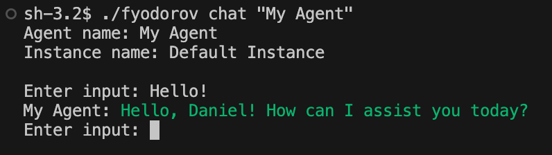

# Fyodorov CLI Tool

The Fyodorov CLI tool is designed to streamline your interaction with Fyodorov services, including authentication, and deployment. Below are the instructions to get started with signing up and deploying your configuration. You can also follow a demo in [this youtube video](https://www.youtube.com/watch?v=XjqWd81iJK0).

## Installation

Before using the Fyodorov CLI tool, ensure you downloaded the correct binary for your system [here](https://github.com/FyodorovAI/fyodorov-cli/releases)

## Signing Up

To start using the Fyodorov services, you must first sign up and authenticate. You can do this directly through the CLI tool:

```shell
fyodorov auth
```

You can use the default hosted version at [https://gagarin.danielransom.com](https://gagarin.danielransom.com)
 to sign up and test your models.

You will need an invite code. If you weren't provided with one you can try this one: `GITHUB`

## Deploying the Configuration

If you haven't already created a configuration file, here's an example `config.yml` to get started:

```yaml
version: 0.0.1
providers:
  - name: openai
    api_url: https://api.openai.com/v1
models:
  - name: chatgpt
    provider: openai
    model_info:
      mode: chat
      base_model: gpt-3.5-turbo
agents:
  - name: My Agent
    description: My agent for chat conversations
    model: chatgpt
    prompt: My name is Daniel. Please greet me and politely answer my questions.
```

Once your configuration is set and saved, you can deploy it using the Fyodorov CLI tool:

```shell
fyodorov deploy config.yml
```

This command will deploy your current configuration to the Fyodorov platform. However, you will need to
 set the API key for the provider. You can create an API key for OpenAI [here](https://platform.openai.com/api-keys).

The tool will automatically insert any environmental variables into the yaml file. Here's an example yaml file and how to deploy it.

`test_config.yaml`

```yaml
providers:
  - name: openai
    api_url: https://api.openai.com/v1
    api_key: ${OPENAI_API_KEY}
models:
  - name: chatgpt
    provider: openai
```

```shell
cat .env
# OPENAI_API_KEY=sk-EXAMPLE_API_KEY
source .env
fyodorov deploy test_config.yaml
```

Here's an example of deploying the above file, and setting the API key for the OpenAI provider via command line arg:

```shell
fyodorov deploy test_config.yaml --set "providers[0].api_key=sk-00000000000"
```

## Chatting with your agent

The command `fyodorov chat` allows you to interact with an agent from the command line tool.
 If you just run that command, you will see a list of agents you have deployed, with their name followed by their ID.


In the example configuration above, we created an agent called `"My Agent"`. We can chat with this specific agent
 by using this command:

```shell
fyodorov chat "My Agent"
```

You will be able to chat with your agent like this:


## Getting Help

For more detailed information about each command, you can use the help flag:

```shell
fyodorov [command] --help
```

For example:

```shell
fyodorov deploy --help
```

This will provide detailed usage instructions for the deploy command.

## Flags and Environmental Variables

### Flags

You can set flags like `fyodorov --gagarin-url https://gagarin.danielransom.com`.
The list of global flags can be found by running `fyodorov --help`.
You will see something like the following output:

```plaintext
Flags:
  -u, --email string             email for authentication
  -b, --gagarin-url string       base URL for 'Gagarin'
  -h, --help                     help for fyodorov
  -n, --no-cache                 disable cache
  -p, --password string          password for authentication
  -t, --tsiolkovsky-url string   base URL for 'Tsiolkovsky'
```

### Environmental Variables

For each flag there is a corresponding environmental variable, which is in ALL CAPS and replaces each `-` with an `_`.
 These environmental variables are case sensitive. Here are some examples showing how to set an env var for the command
  line tool.

```shell
export GAGARIN_URL="https://gagarin.danielransom.com"
export EMAIL="email@example.com"
export PASSWORD="my_secret_pa$$word"
fyodorov auth
# Authenticated successfully!
```
